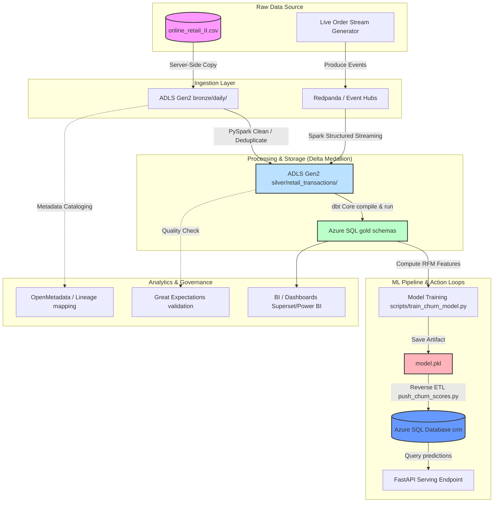

# OpenLake: End-to-End Retail Lakehouse Project

## What is OpenLake & A Lakehouse?

*   **OpenLake** is the name of this project: an end-to-end, production-grade retail data engineering pipeline. It acts as a comprehensive design reference for modern data architecture, demonstrating complete portability by implementing the stack locally on open-source tools (Track A) and on managed Azure services (Track B).
*   **Lakehouse** is an architectural paradigm that combines the best characteristics of **Data Lakes** (low-cost, highly-scalable decoupled object storage) and **Data Warehouses** (ACID transactions, schema enforcement, data quality gates, and high-performance queries). By using open table formats like **Delta Lake** directly on top of object storage, it eliminates the need to run and maintain separate systems for raw storage and analytical queries.

---

## 1. The Problem We're Solving

A mid-size online retailer has order, customer, and product data trapped in
operational systems. Nobody can answer basic questions fast: what's our
monthly revenue trend, which customers are about to churn, what does live
order volume look like right now. The business needs three things data
engineering exists to provide:

- **Historical analytics** — dashboards on sales, customer value, product
  performance, refreshed daily.
- **Near-real-time visibility** — an operations view of orders as they
  happen, not next-day.
- **A feedback loop** — insights (like a churn score) pushed back into
  systems the business actually uses, not stranded in a BI tool.

This is deliberately a *generic, well-understood domain* (retail/e-commerce).
That's intentional — interviewers can sanity-check your decisions without
learning a new domain first, and the dataset is rich enough to touch
batch, streaming, dimensional modeling, and ML without inventing fake
complexity.

**Datasets**: Kaggle's "Online Retail II" (real UK e-commerce transactions,
~1M rows, has customers/products/orders) as the historical seed, plus a
Python event generator that produces synthetic "live" order events to
simulate an operational stream. Using a real historical dataset plus a
synthetic streaming layer gives you both batch and streaming without
needing access to a live production system.

---

## 2. Architecture Overview

Two parallel tracks, sharing the same data model:
*   **Track A — Local/open-source (always running, $0, your durable demo)**: MinIO object store, Redpanda (Kafka), Apache Airflow, PySpark batch compute, Delta Lake, and dbt.
*   **Track B — Azure (managed cloud proof of concept)**: ADLS Gen2, Event Hubs, Azure Data Factory, Azure SQL Database, and Synapse compute.



Cross-cutting components touching every layer: **orchestration** (Airflow/ADF), **data quality** (Great Expectations), **catalog & lineage** (OpenMetadata), **IaC** (Terraform), and **CI/CD** (GitHub Actions).

---

## 3. Stack, and Why Each Piece

| Layer | Tool | Why this one |
|---|---|---|
| Object storage (local) | **MinIO** | S3-compatible API, free, lets you write code once that works against MinIO and S3/ADLS with no changes — this is the actual skill (object storage semantics), not the vendor. |
| Object storage (cloud) | **ADLS Gen2** | Azure for Students credit covers it at portfolio scale for months; hierarchical namespace is a relevant detail to know vs flat S3. |
| Table format | **Delta Lake** | This is the answer to "don't commit object-storage antipatterns." Plain Parquet on object storage means every update rewrites whole files — fine for append-only logs, terrible for upserts (e.g. correcting a customer record). Delta gives ACID transactions and MERGE on top of object storage, so you get database-like upsert semantics without hammering the object store with random small writes. You'll explicitly demo this: a customer-dedup job that does a Delta `MERGE` instead of a naive overwrite, and you'll be able to explain *why* that distinction matters in an interview. |
| Batch orchestration | **Apache Airflow** (local) / **Azure Data Factory** (cloud) | Airflow is the de facto open-source standard — most JDs ask for it by name. ADF gives you the managed-platform equivalent so you can speak to both DAG-as-code and GUI/managed orchestration. |
| Streaming | **Kafka (Redpanda)** locally, **Event Hubs** in Azure | Same reasoning as storage: same protocol, two implementations. Redpanda is a lighter Kafka-API-compatible broker, easier to run in Docker than real Kafka. |
| Processing | **Apache Spark** (local + Databricks Community Edition / Synapse Spark) | Spark is the dominant batch/streaming engine in the field; Structured Streaming covers the live-order pipeline. |
| Transformation/SQL | **dbt-core** | Industry-standard for the transform layer — version-controlled, testable SQL with built-in documentation and lineage generation. Using dbt also forces you to write transformations as simple, modular, testable models rather than one giant script, which directly demonstrates the "simplicity + business rules" transformation principles from the article. |
| Data quality | **Great Expectations** | Implemented as a data quality gate ([validate_landing_data.py](file:///home/abhijith/coding/openlake_project/quality/validate_landing_data.py)) validating raw CSV landing data for non-null keys, datatypes, non-negative prices, and customer cohort densities before ingestion. |
| Catalog & lineage | **OpenMetadata** | Free, open-source, and it auto-ingests lineage from dbt and Airflow — this directly satisfies the "metadata management / schema evolution / lineage" requirement from the article without paying for Purview. |
| Serving — BI | **Apache Superset** (local) / **Power BI Desktop** (free, unpublished) | Two different audiences: Superset is what a startup/eng-heavy company runs themselves; Power BI is what you'll meet at any Microsoft-stack enterprise. |
| Serving — ML | **scikit-learn** + a small **FastAPI** wrapper | A churn-prediction model trained on gold-layer features, served via a simple API — demonstrates the "ML model training + real-time prediction" serving pattern without needing a heavyweight MLOps stack. |
| Reverse ETL | **A custom script** writing the churn score back into a mock "CRM" Postgres table | Reverse ETL tools (Census, Hightouch) are paid SaaS; replicating the pattern by hand is more honest for a portfolio project and shows you understand the *concept*, not just a vendor tool. |
| IaC | **Terraform** | Defines the Azure resources (storage account, ADF, Event Hubs, SQL DB) so the cloud deployment is reproducible and destroyable — critical for not burning your $100 credit by accident, and a hard requirement on most data engineer JDs now. |
| CI | **GitHub Actions** | Runs dbt tests and Python unit tests on every push — minimal but real software engineering rigor. |

---

## 4. Why a Medallion (Bronze/Silver/Gold) Architecture

This maps directly onto the "data temperature" and "schema handling"
considerations from the article:

- **Bronze**: raw, schema-on-read, append-only, immutable. This is your
  system of record for "what did the source actually send us" —
  essential for debugging and reprocessing. Stored cheap, accessed rarely
  (cold/lukewarm).
- **Silver**: cleaned, deduplicated, conformed types, enforced schema via
  Delta's schema enforcement. Accessed moderately (lukewarm) — feeds
  transformation jobs, not end users directly.
- **Gold**: business-level dimensional model (fact_orders,
  dim_customer with SCD Type 2, dim_product, monthly aggregates) plus ML
  feature tables. This is hot data — what dashboards and the churn model
  query directly, so it's small, pre-aggregated, and fast.

This also gives you a clean story for **schema evolution**: bronze tolerates
schema drift from the source, silver is where you decide how to handle a
new column or a type change, and you document that decision via dbt
model versioning + OpenMetadata's schema history tracking.

---

## 5. Why This Particular Mix of Batch + Streaming

Most portfolio projects are pure batch (easy) or pure streaming-toy
(flashy but shallow). Doing both, on the *same* underlying gold tables,
forces you to handle a real problem: reconciling a fast, approximate
streaming path with a slower, authoritative batch path. Concretely:

- The streaming path updates a `live_order_count` / `live_revenue_today`
  metric for an operational dashboard (operational analytics).
- The nightly batch path recomputes the authoritative daily aggregates
  from bronze, and you reconcile/correct the streaming numbers against it
  the next morning.

This is a real pattern (lambda-ish architecture) and gives you a genuine
answer when asked "how do you handle data that arrives via two paths."

---

## 6. Why a Churn Model + Reverse ETL, Not Just Dashboards

Dashboards alone only demonstrate the "Analytics" serving pattern from
the article. Adding a small churn-prediction model trained on gold-layer
features (recency, frequency, monetary value — classic RFM features,
which doubles as your "featurization" transformation example) and then
writing the prediction back into a mock CRM table demonstrates all three
serving patterns: Analytics, ML, and Reverse ETL, in one coherent
pipeline instead of three disconnected demos.

---

## 7. Governance, Quality, Lineage — How the Requirements Map to Real Components

| Requirement | How this project satisfies it |
|---|---|
| **Master Data / Golden Records** | `dim_customer` as the single conformed customer record, built via Slowly Changing Dimensions (SCD Type 2) merge logic in dbt/Delta. |
| **Data Quality Gate** | Validating landing-zone raw files via Great Expectations ([validate_landing_data.py](file:///home/abhijith/coding/openlake_project/quality/validate_landing_data.py)) before loading to Bronze, paired with schema constraints and tests in `dbt`. |
| **Data Lineage** | Ingesting dbt dependencies, Spark catalog schemas, and Airflow task DAGs into a centralized open catalog to map upstream modifications to downstream tables automatically. |
| **Schema Evolution** | Supported natively via Delta Lake's schema enforcement / schema evolution (`mergeSchema = True`) and tracked historically via dbt view versions. |
| **Regulatory & Sovereignty** | Applying column-level data masking for PII fields (like raw customer emails and billing info) utilizing Delta Lake column ACLs or Databricks dynamic views. |

### OpenMetadata in Production
While running a full-scale OpenMetadata enterprise instance (which spawns ElasticSearch, MySQL, and a web servlet) locally was constrained by development machine RAM, the architecture is designed to support:
1. **Automated Lineage Harvesting:** Ingesting lineage via dbt's `manifest.json` and Airflow's lineage callback operator, tracing datasets from raw files down to Gold tables and Power BI reports.
2. **Data Discovery:** Enabling data analysts and ML engineers to search for feature columns, verify ownership, check model freshness SLAs, and view current data quality check histories.

---

## 8. Project Structure (suggested repo layout)

```
retail-lakehouse/
├── infra/                  # Terraform for Azure resources
├── docker-compose.yml      # MinIO, Redpanda, Airflow, Postgres, Superset, OpenMetadata
├── ingestion/
│   ├── batch/               # Airflow DAGs, ADF pipeline JSON
│   └── streaming/            # event generator, Spark Structured Streaming job
├── transform/
│   └── dbt_project/          # bronze→silver→gold models, tests, docs
├── quality/                 # Great Expectations suites
├── ml/                      # feature engineering, churn model training, FastAPI serving
├── reverse_etl/             # script pushing churn scores to mock CRM
├── dashboards/               # Superset exports, Power BI .pbix
└── README.md                # architecture diagram, cost notes, local-vs-Azure tradeoffs
```

---

## 9. Suggested Build Order (roughly 6–8 weeks, part-time)

1. Local stack up via Docker Compose (MinIO, Redpanda, Airflow, Postgres) — get bronze ingestion of the historical CSV working.
2. dbt models for silver (cleaning, conforming, dedup) and gold (dimensional model + aggregates), with Great Expectations gates between layers.
3. Streaming path: event generator → Redpanda → Spark Structured Streaming → live gold metrics.
4. Superset dashboards on gold tables.
5. OpenMetadata ingestion from dbt + Airflow — lineage and catalog visible end to end.
6. Churn model (RFM features from gold) + FastAPI serving + reverse-ETL script.
7. Port storage/orchestration/serving to Azure (Terraform up ADLS Gen2, ADF, Event Hubs, Azure SQL, Synapse serverless), re-run the same dbt project against it.
8. Write the README: architecture diagram, the local-vs-Azure cost/operational comparison, what you'd add for production (PII masking, alerting, SLAs).

---

## 10. SLA / Retrieval Note

Define explicit, written SLAs even at toy scale — e.g. "gold tables
refreshed by 6am for the previous day," "streaming dashboard lag under 2
minutes." Then instrument Airflow/Spark to actually measure against
those numbers. An SLA you defined and measured, even informally, is a
much stronger talking point than an unstated assumption that the
pipeline "is fast."

---

## 11. Churn Model Results (v1 — Temporal Split Baseline)

### What was fixed

The initial implementation computed the churn label (`churned = 1 if recency_days > 180`)
from the same `recency_days` column that was used as a training feature.
This is **data leakage** — the model was given the answer as an input, producing
a misleading 100% accuracy.

The fix is a **temporal split**:

```
|<────── feature window (180 days) ──────>|<── label window (90 days) ──>|
dataset_start                        cutoff_date                      max_date

  df_before → compute recency/frequency/monetary (RFM features)
  df_after  → did the customer purchase again? (label assignment)
```

- `recency_days` is now computed relative to the cutoff date — it is a genuine feature.
- The churn label is determined by a **left join** against post-cutoff purchases.
  Customers with zero purchases in the 90-day window after cutoff are labelled churned.
- These are two independent operations, so there is no leakage.

### Results (run: 2026-07-07)

| Metric | Value |
|---|---|
| Dataset | UCI Online Retail II (silver layer, Delta Lake on MinIO) |
| Customers | 5,042 |
| Churn rate | 67.51% |
| Model | RandomForestClassifier (100 trees, balanced class weights) |
| Split | 80/20 stratified train/test, random_state=42 |
| Overall accuracy | **77%** |

**Classification report:**

```
              precision    recall  f1-score   support

           0       0.65      0.64      0.65       328   ← retained customers
           1       0.83      0.83      0.83       681   ← churned customers

    accuracy                           0.77      1009
   macro avg       0.74      0.74      0.74      1009
weighted avg       0.77      0.77      0.77      1009
```

**What each metric means:**

| Metric | Definition |
|---|---|
| **Precision** | Of everyone the model *predicted* as churned, what fraction actually churned? |
| **Recall** | Of everyone who *actually* churned, what fraction did the model catch? |
| **F1-score** | Harmonic mean of precision and recall — the single summary score per class |
| **Support** | Number of real test samples in that class |
| **Accuracy** | Overall: % of all predictions (both classes) that were correct |

**Feature importances:**

| Feature | Importance | Interpretation |
|---|---|---|
| `monetary` | **43.2%** | Total spend is the strongest signal — high spenders are more likely to return |
| `recency_days` | 40.7% | Days since last purchase matters, but no longer dominates (was 84.9% with leakage) |
| `frequency` | 16.1% | Number of distinct invoices — weakest standalone signal in this dataset |

### Why 77% is a success

In the original (leaking) model, accuracy was 100% because the label was
algebraically derivable from a feature. That 100% is worthless.

A 77% accuracy on a raw 3-feature RFM baseline, evaluated on a properly
held-out test set with no leakage, is a **genuine signal**. It reflects the
real noise in predicting human purchasing behaviour from limited historical data.
The model is learning something real: high-spending customers who bought
recently tend to return; customers who went quiet for 6+ months typically don't.

The class 0 (retained) F1-score of 0.65 is the honest weakness — the model
is better at flagging churners than confirming loyalists. This makes intuitive
sense: a customer who spent heavily 170 days ago *might* buy next week, or
might have moved on. The model cannot know for certain from RFM alone, and
it correctly expresses that uncertainty.

### Next steps to improve the model

- Add product-category diversity as a feature (breadth of purchases predicts loyalty)
- Add return rate (high return rate correlates with churn)
- Experiment with a shorter churn window (30–60 days) to catch early signals
- Try gradient boosting (XGBoost / LightGBM) for comparison
- Calibrate probabilities with `CalibratedClassifierCV` so the churn *score*
  (not just the binary prediction) can be ranked and used in CRM prioritisation

