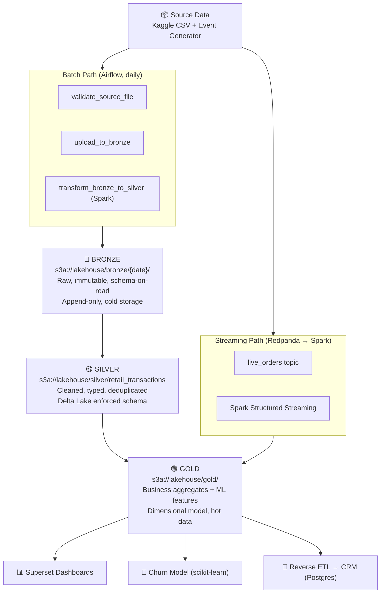
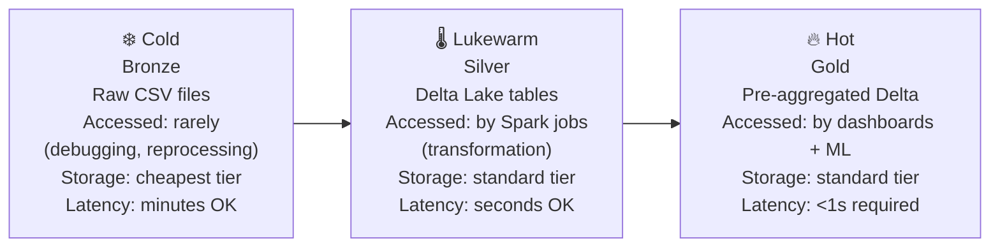
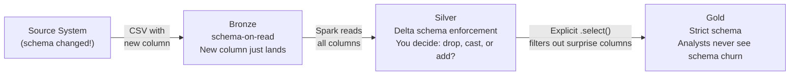
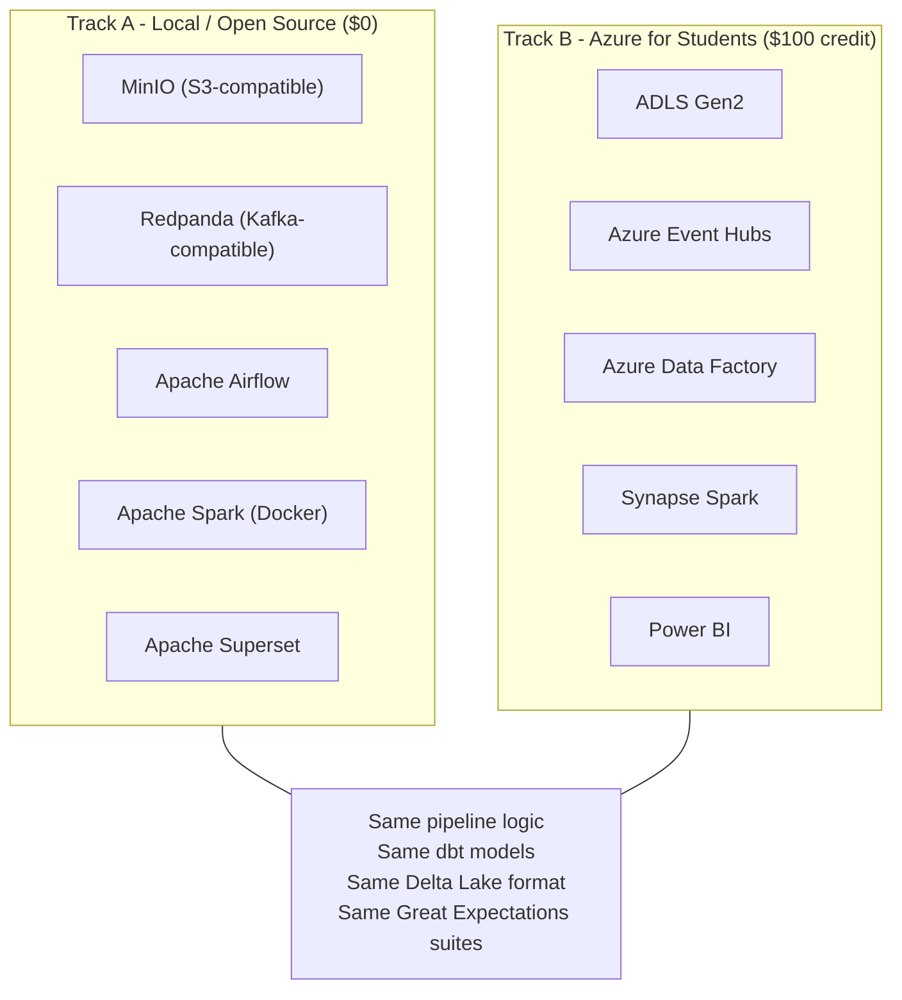

# Chapter 1: Architecture & The Medallion Pattern

*← [Back to Index](./index.md)*

---

## 1.1 What is a Lakehouse and OpenLake?

Before building the system, it is vital to define the core concepts that structure this project:

*   **Data Lake**: A vast repository that stores raw, unstructured, semi-structured, and structured data in its original format (e.g., CSV, JSON, Parquet) on inexpensive object storage (e.g., MinIO, S3). It scales compute-independently and cheaply but lacks transactions, schema enforcement, and indexing.
*   **Data Warehouse**: A highly-structured relational database optimized for analytics. It offers rich SQL querying, ACID transactions, and rigid schema validation, but is expensive, scales storage and compute together, and often locks you into a proprietary format.
*   **Lakehouse**: A unified architecture that implements database-like features (ACID transactions, schema governance, index-based query performance, and time travel) directly on the low-cost, scalable object storage of a data lake. This is enabled by transactional open table formats like **Delta Lake**.
*   **OpenLake**: The name of this project. It is an end-to-end, production-grade retail data engineering project that builds a Lakehouse using entirely **open standards and open-source tools** (Delta Lake, Apache Spark, Redpanda, Apache Airflow, dbt, OpenMetadata). By using open APIs (like S3 and Kafka), the entire pipeline is portable—running identically on local Docker Compose (Track A) or managed Azure (Track B).

> [!TIP]
> **Interview Answer**: A Lakehouse is an architecture that brings data warehouse capabilities (like ACID transactions, schema enforcement, and time travel) directly onto cheap object storage using open formats like Delta Lake. It bridges the gap between data lakes and data warehouses, eliminating the need to duplicate and synchronize data across separate systems.

---

## 1.2 The Problem This System Exists to Solve

Before writing a single line of code, I spent time thinking about the business
problem. Not because it's interesting to pretend I work at a UK e-commerce company,
but because every architectural decision I made later traces back to a specific
business requirement. If you can't explain *why* a layer exists, you can't defend it.

The retailer has three systems running: an order management system, a customer
database, and a product catalog. Each runs its own Postgres database. Nobody can
answer the following questions without someone pulling a CSV and running it through
Excel:

- What is our monthly revenue trend over the last 18 months?
- Which customers are at risk of churning - and who should the CRM team call first?
- How many orders came in during the last hour?

These are not exotic questions. Every mid-size retailer needs these answers. The
problem is that the operational databases are designed for *writes* - they process
orders, update customer records, run transactions. They're not designed for
*reads across time*. Joining a year of orders with a customer dimension in Postgres
produces query times measured in minutes, not seconds. Meanwhile, analysts
query it during business hours and compete with real order traffic.

This is the classic argument for separating *operational* from *analytical*
workloads. The data engineering system I built is the bridge between them.

The three specific requirements that shaped the architecture:

1. **Historical analytics** - dashboards on sales, customer lifetime value, product
   performance, refreshed daily. Latency of hours is acceptable.
2. **Near-real-time visibility** - an operational view of orders as they arrive,
   not next-day. Latency of minutes is acceptable.
3. **A feedback loop** - insights (churn scores) must be pushed *back* into the
   systems the business actually uses. Data that stays in a lakehouse and never
   reaches the CRM team is data that produces no business value.

---

## 1.3 Why Not Just Use Postgres?

The most common pushback I get when I explain this system is: *"why not just ETL
everything into a single well-tuned Postgres database?"*

It's a fair question. Postgres is genuinely excellent software. It supports JSON,
has a query planner that's hard to beat at moderate scale, and every engineer already
knows SQL. So why build something more complex?

The answer comes in three parts:

**Scale and columnar access patterns.** Analytical queries have a specific shape:
they scan many rows but only need a few columns. A query like
`SELECT SUM(revenue) FROM orders WHERE month = '2025-12'` on a 50M-row table
needs to touch the `revenue` and `month` columns - nothing else. In a row-based
store like Postgres, reading those two columns still requires reading every row
in full, because the data is laid out row-by-row on disk. Columnar formats like
Parquet (which Delta Lake uses underneath) store each column contiguously, so that
query reads a tiny fraction of the data. At 50M rows the difference is 10x
in I/O. At 500M rows it's the difference between a dashboard that loads and one
that times out.

**Update semantics at scale.** Object storage (S3, MinIO, ADLS Gen2) is cheap -
orders of magnitude cheaper per GB than managed Postgres. But object storage has
no concept of in-place updates. You cannot `UPDATE orders SET status = 'shipped'
WHERE order_id = 12345` on a file. You rewrite the file. Delta Lake (Chapter 5)
solves this with MERGE semantics on top of object storage, but the key point is
that the storage layer itself is fundamentally different, and that difference
drives different architectural choices throughout.

**Separation of concerns.** A lakehouse stores raw data in the Bronze layer
*before* any transformation decisions are made. If I discover six months from now
that my revenue calculation was wrong (wrong tax treatment, for example), I can
reprocess from Bronze. With a single Postgres pipeline that transforms on ingest,
the raw data is gone - I can only reprocess from whatever state I saved.

> [!TIP]
> **Interview Answer**: A single Postgres database conflates storage, compute, and
> transformation. A lakehouse separates them: cheap object storage holds the data
> at any scale, a distributed compute engine (Spark) processes it, and a table
> format (Delta Lake) provides ACID semantics on top. You get the durability of
> raw data, the query performance of columnar formats, and the ability to scale
> compute independently of storage - none of which a single Postgres gives you.

---

## 1.4 Why Retail? Defending the Domain Choice

I picked retail/e-commerce deliberately. Not because it's exciting, but because
of what it enables in an interview context.

An interviewer evaluating a data engineering project doesn't want to spend 20
minutes learning your domain before they can ask technical questions. Healthcare
data has HIPAA. Finance data has compliance rules and domain-specific concepts
(CUSIP, settlement cycles, NAV calculation). If I built a financial data pipeline,
a third of the interview would be explaining the domain. Retail is universally
understood: customers place orders, orders contain products, revenue is quantity
times price. The interviewer can sanity-check my numbers immediately.

More importantly, retail data has the right *shape* for this project:
- It has a **natural customer dimension** (supports SCD Type 2, churn modeling, RFM)
- It has **transactional history** (facts, aggregates, trend analysis)
- It has both **batch characteristics** (monthly sales reports) and
  **streaming characteristics** (live order volume during a sale event)

The Kaggle "Online Retail II" dataset (~1M real UK e-commerce transactions) gives
me all of this without inventing synthetic data. I then added a Python event
generator that produces synthetic live orders to simulate the streaming path -
giving me both batch and streaming without needing access to a live production system.

> [!TIP]
> **Interview Answer**: I chose retail because the domain is universally
> understood, which means the interviewer can verify my logic immediately without
> needing domain education. The dataset is also structurally rich: it has
> customers, products, transactions, time dimensions, and enough volume to
> demonstrate batch, streaming, dimensional modeling, and ML without manufacturing
> fake complexity.

---

## 1.5 The Medallion Architecture - Bronze, Silver, Gold

The core architectural pattern is the Medallion (also called Multi-Hop) architecture.
Data flows through three layers, each with a specific contract about what it
contains and who can touch it.



Each layer answers a different question:

### Bronze: What did the source actually send us?

Bronze is append-only and immutable. The raw CSV lands exactly as-is from the
source system, partitioned by ingestion date:

```
s3a://lakehouse/bronze/2026-07-07/online_retail_II.csv
s3a://lakehouse/bronze/2026-07-06/online_retail_II.csv
```

This partitioning is done by the Airflow DAG - the key in MinIO is literally
`bronze/{execution_date}/online_retail_II.csv`. See
[`dags/bronze_ingestion.py#L30`](../dags/bronze_ingestion.py#L30):

```python
bronze_key = f"bronze/{execution_date}/online_retail_II.csv"
```

Bronze uses schema-on-read: there's no schema enforcement at this layer. If the
source sends a new column tomorrow, Bronze just holds it. The transformation
logic in Silver decides what to do with it. This is intentional - Bronze's
contract is to be a faithful record of what the source system sent, full stop.

**What Bronze is NOT**: It is not a queryable layer for analysts. It is not
a staging area you clean up. It is not a "temporary" store. It is the permanent,
durable audit log of your source data. You never delete from Bronze.

> [!TIP]
> **Interview Answer**: Bronze is immutable and schema-on-read. Its only contract
> is "we received this data from the source at this time." It exists so that if any
> downstream transformation turns out to be wrong, we can reprocess from the
> beginning without going back to the source system. Deleting or modifying Bronze
> destroys your only ground truth.

**What if I need to "fix" raw data?**

You don't. If raw data has a problem - a malformed timestamp, a bad encoding, a
corrupted row - you handle it in Silver during transformation. You never touch Bronze.
If the source system sent you bad data, that *is* the historical record of what
happened. You record the bad data in Bronze and your Silver transformation filters
or quarantines it. This way, if the source system later corrects the data and
resends, you can reprocess and the correction flows through correctly.

The only exception is if you ingested something you were legally required not to
store (e.g., PII that should have been masked at ingestion). In that case you'd
need to surgically remove specific records from Bronze - which is possible with
Delta Lake's `DELETE` + `VACUUM`, but painful and auditable.

### Silver: What does clean, reliable data look like?

Silver is where transformation decisions live. The job that produces Silver
([`scripts/transform_bronze_to_silver.py`](../scripts/transform_bronze_to_silver.py))
does the following:

1. **Filters nulls** in the primary key (`Invoice`)
2. **Type-casts** all columns to correct types (timestamp parsing, integer/double casting)
3. **Renames** columns to consistent snake_case names (`Customer ID` → `customer_id`)
4. **Derives** the `revenue` column (`Quantity × Price`)
5. **Adds** `ingested_at` audit timestamp
6. **Writes** to Delta Lake with `mergeSchema: true`

The key transformation block (lines 41–61):

```python
df_cleaned = df_raw \
    .filter(col("Invoice").isNotNull()) \
    .withColumn("invoice_date", to_timestamp(col("InvoiceDate"), "yyyy-MM-dd HH:mm:ss")) \
    .withColumnRenamed("Customer ID", "customer_id") \
    .withColumnRenamed("StockCode", "product_id") \
    .withColumn("quantity", col("Quantity").cast(IntegerType())) \
    .withColumn("price", col("Price").cast(DoubleType())) \
    .withColumn("ingested_at", current_timestamp()) \
    .withColumn("revenue", col("Quantity").cast(DoubleType()) * col("Price").cast(DoubleType())) \
    .select(
        col("Invoice").alias("invoice_id"),
        col("product_id"),
        col("Description").alias("description"),
        col("quantity"),
        col("invoice_date"),
        col("price"),
        col("customer_id"),
        col("Country").alias("country"),
        col("ingested_at"),
        col("revenue")
    )
```

Silver uses Delta Lake's schema enforcement (more on this in Chapter 5). Once a
schema is established for the Silver table, new data must conform or the job fails.
This is the *controlled* schema evolution point - you decide explicitly how to
handle a new column or a type change, and you document that decision.

Silver is *not* directly exposed to analysts in this project. It's a staging layer
for Gold. If you exposed Silver, analysts would start building reports on partially-
processed data, and you'd lose the ability to change the Silver schema without
breaking their work.

### Gold: What does the business need to answer its questions?

Gold is dimensional model territory. It contains:
- Pre-aggregated business metrics (daily revenue, monthly active customers)
- Dimensional model tables (`fact_orders`, `dim_customer`, `dim_product`)
- ML feature tables (RFM features for the churn model)
- Live streaming metrics (`live_order_metrics` - from the streaming path)

Gold is small, pre-computed, and fast. Superset queries Gold directly. The churn
model reads its features from Gold. The Reverse ETL script writes churn scores
back to the CRM by reading Gold predictions.

> [!TIP]
> **Interview Answer**: Gold is not the same as a Data Mart, though they serve
> similar purposes. A Data Mart is typically a standalone database built from a
> warehouse with its own ETL process. Gold is a layer in the same storage system
> as Bronze and Silver, built from the same Delta Lake on the same MinIO instance.
> The difference is architectural: in a Medallion lakehouse, Gold shares lineage
> with Bronze and Silver through the same pipeline. In a Data Mart, lineage is
> often opaque and the ETL process is separate from the main warehouse pipeline.

---

## 1.6 Data Temperature

"Data temperature" is a useful metaphor for how frequently data is accessed and
how much latency you can tolerate on reads.



In practice, this maps to storage decisions:

- **Bronze**: If you were on a cloud provider, you'd use the cold/archive tier
  (AWS Glacier, Azure Archive). Access costs slightly more per read, but storage
  is 10x cheaper. You access it rarely - only when debugging or reprocessing.
  In our local setup, it's just MinIO with no tiering, but the *intent* is cold.

- **Silver**: Standard object storage. Accessed by Spark transformation jobs but
  not by end-user queries. Latency of a few seconds per read is fine.

- **Gold**: Standard object storage, but the data is small (pre-aggregated) so
  reads are fast. Superset hits Gold directly, so queries need to complete in
  under a second. This is possible because Gold is pre-computed - Superset isn't
  running `GROUP BY` on 1M rows, it's selecting from a table that already has
  the aggregates.

> [!TIP]
> **Interview Answer**: Data temperature describes the access frequency and
> latency requirements of each layer. Bronze is cold - accessed rarely, stores
> cheaply. Silver is lukewarm - accessed by batch jobs but not users. Gold is
> hot - queried directly by dashboards, needs sub-second response. Mapping your
> data to temperature tiers is how you avoid over-provisioning expensive storage
> for data that's touched once a quarter.

---

## 1.7 Schema Drift - Where Do You Handle It?

Schema drift is when the upstream source system changes its data structure without
warning. A new column appears. A column is renamed. A type changes from string to
integer. These are real events that happen in production, and your pipeline needs
a strategy.

In the Medallion architecture, the answer is clear: **Bronze tolerates drift,
Silver resolves it, Gold never sees it.**



In practice:
- The Bronze layer reads the CSV with a defined schema, but `nulls` are tolerated
  for unknown columns. If a new column appears, it lands in Bronze.
- The Silver transformation in [`transform_bronze_to_silver.py`](../scripts/transform_bronze_to_silver.py)
  ends with an explicit `.select()` that enumerates *exactly* which columns make
  it to Silver. A surprise new column in Bronze is silently dropped unless someone
  explicitly adds it to the Silver schema.
- Gold is built from Silver, so it's protected from Bronze-level surprises entirely.

The `mergeSchema: true` option on the Silver write is an important nuance:
```python
df_cleaned.write \
    .format("delta") \
    .mode("append") \
    .option("mergeSchema", "true") \
    .save(silver_path)
```

`mergeSchema: true` means that if the Silver DataFrame has *more* columns than
the existing Delta table, Delta Lake will add those columns to the table schema.
This is a controlled opt-in, not a default. Without it, Delta Lake would reject
any write that doesn't conform to the established schema (strict enforcement).

> [!TIP]
> **Answer - How do you handle schema drift in your pipeline?**
> We isolate schema drift through our Medallion layout so it doesn't break our analytical views:
> 
> 1. **Bronze (Raw):** We use a permissive schema-on-read model. This guarantees we always land incoming data, even if the source system changes column configurations without warning.
> 2. **Silver (Cleaned):** During conformed transformations, we utilize Delta's schema evolution setting (`mergeSchema = True`) to allow new columns to append cleanly without breaking existing readers.
> 3. **Gold (Analytical/BI):** Downstream views and dbt schemas are versioned. New columns are explicitly mapped, ensuring BI dashboards and ML models are insulated from unexpected upstream changes until they are updated to consume them.
> 
> Enforcing schema validation too early (e.g. at the ingestion boundary) is a common failure mode; it leads to critical pipelines failing immediately when an upstream team adds a benign field, rather than processing the field gracefully.

---

## 1.8 The System of Record

In a Medallion architecture, the **Bronze layer is the system of record**.

This is counterintuitive. Most people would say "the Gold layer is the most
important, so it must be the system of record." But the system of record is
the layer you'd use to rebuild everything else from scratch. If Gold is corrupted
or your Silver transformation logic was wrong for six months, you reprocess from
Bronze. You can't reprocess from Gold back to Silver.

Bronze is the system of record for *what the source sent*. The operational Postgres
databases are the system of record for *the business's current state*. The lakehouse
Bronze layer is a historical record of every snapshot we pulled from those sources.

This is also why Bronze is immutable. If you could modify Bronze, it would no longer
be a reliable system of record - it would be a mutable staging area, and you'd
have lost your audit trail.

> [!TIP]
> **Interview Answer**: Bronze is the system of record. It's the only layer that
> can be used to rebuild the entire downstream pipeline from scratch. Silver and
> Gold are derived artifacts - if the transformation logic changes, you regenerate
> them from Bronze. Calling Gold the system of record is a common mistake; Gold
> is the *serving* layer, not the source of truth.

---

## 1.9 Data Engineering vs. Data Analysis - In This Project

These terms are often confused. In the context of this project:

**Data Engineering** is everything I built:
- The ingestion pipelines (Airflow DAGs, Spark jobs)
- The storage infrastructure (MinIO, Delta Lake)
- The transformation logic (Bronze → Silver → Gold)
- The streaming pipeline (Redpanda → Spark Structured Streaming → Gold)
- The ML training pipeline (feature engineering, model training, serialisation)
- The Reverse ETL script

**Data Analysis** is what the *consumers* of this system do:
- An analyst opening Superset and looking at the revenue trend dashboard
- A data scientist pulling Gold-layer features to experiment with a different model
- A CRM manager filtering the churn scores table in Postgres to build a call list

The key distinction: data engineering is about *reliability, repeatability, and
correctness of the data flow*. Data analysis is about *interpreting the data
that flows*. A data engineer's job is done when the Gold tables are correct and
available on time. What the analyst concludes from those tables is their job.

In this project I do both - I built the pipeline AND trained the churn model AND
built the Superset dashboard. But in a real organisation these roles are separate,
and the pipeline I built is designed to make the analysts' job easier without
requiring them to understand how it works.

---

## 1.10 Which Layer Do You Query for a Live 5-Second Report?

If someone asks "I need a live report that shows total orders in the last 5 minutes
and it needs to load in under 5 seconds" - the answer is **Gold, from the streaming
path**.

Here's why each layer fails:
- **Bronze**: Raw CSV files. No query engine is fast against unstructured CSV at
  any scale. Also, Bronze has no live data - it's refreshed daily.
- **Silver**: Delta Lake, but contains all raw transaction rows. Aggregating on
  the fly is possible but slow at volume, and like Bronze, it has no live data
  (it's fed by the daily batch job).
- **Gold (batch path)**: Pre-aggregated, but only refreshed nightly. If the
  question is "orders in the last 5 minutes," last night's aggregate is useless.
- **Gold (streaming path)**: Pre-aggregated, updated every 10 seconds by the
  Spark Structured Streaming job. This is what you query.

The streaming job ([`scripts/stream_live_orders.py`](../scripts/stream_live_orders.py))
writes to `s3a://lakehouse/gold/live_order_metrics` every 10 seconds:

```python
query = aggregated.writeStream \
    .format("delta") \
    .outputMode("complete") \
    .trigger(processingTime="10 seconds") \
    .start("s3a://lakehouse/gold/live_order_metrics")
```

Superset queries this Delta table directly. The result: the dashboard is always
within 10 seconds of reality, and the query itself is instantaneous because it's
reading a single pre-computed row, not aggregating raw transactions.

> [!TIP]
> **Interview Answer**: Gold, specifically the Gold table produced by the
> streaming path. Bronze and Silver contain raw/cleaned transactions and are only
> refreshed daily. A live report requires a Gold table written by a streaming
> job, not a batch one. The Superset dashboard reads a pre-aggregated single row
> from `gold/live_order_metrics` - the query is O(1) regardless of how many raw
> orders have flowed through the system.

---

## 1.11 The Two-Track Architecture (Local + Azure)

One design decision worth explaining: I built this system twice. Once locally
using open-source tools, and once on Azure using managed services.

The point is not to show off - it's to demonstrate that I understand *what the
tools actually do*, not just how to click through a vendor console. The storage
layer (MinIO locally, ADLS Gen2 on Azure) serves the same S3-compatible API.
The broker (Redpanda locally, Azure Event Hubs on Azure) uses the same Kafka
wire protocol. The transformation logic (dbt, Spark) is identical.

When an interviewer asks "have you used Azure Data Factory?" I can say yes, and I
can also explain how it differs from Airflow conceptually - because I've used both
for the same pipeline. That comparison is itself a strong signal.



The durable, always-on demo is the local track. The Azure track runs while the
$100 student credit lasts, then gets torn down with Terraform (`terraform destroy`).
The Terraform IaC is what makes the cloud deployment reproducible - I can rebuild
the entire Azure environment in 20 minutes from a clean account.

> [!NOTE]
> **📸 TODO Screenshot**: Capture the architecture diagram from the README
> rendered in GitHub, or generate a clean version for embedding here.

---

## Summary: What Chapter 1 Answers

| Question | Short Answer |
|---|---|
| What is a Lakehouse and OpenLake? | Lakehouse: ACID & governance on cheap object storage using Delta Lake. OpenLake: This project, utilizing open-source/open-standard portable components. |
| Why not single Postgres? | Scale, columnar access, separation of concerns, cheap storage |
| Why retail domain? | Universal domain knowledge, rich data shape for all pipeline types |
| What is Medallion? | Bronze (raw) → Silver (clean) → Gold (business-ready), each with a different contract |
| What is data temperature? | Cold (Bronze, rare access) → Warm (Silver, batch jobs) → Hot (Gold, dashboards) |
| Why is Bronze immutable? | It's the system of record; mutating it destroys your audit trail |
| Where does schema drift land? | Bronze tolerates it, Silver resolves it, Gold never sees it |
| Where is the system of record? | Bronze - everything else is derived and can be rebuilt from it |
| Which layer for a live 5s report? | Gold (streaming path) - pre-aggregated, updated every 10 seconds |
| DE vs DA in this project? | DE builds the reliable pipeline; DA interprets the data in it |

---

*Next: [Chapter 2 - Object Storage & Infrastructure](./ch2_storage_infrastructure.md)*
