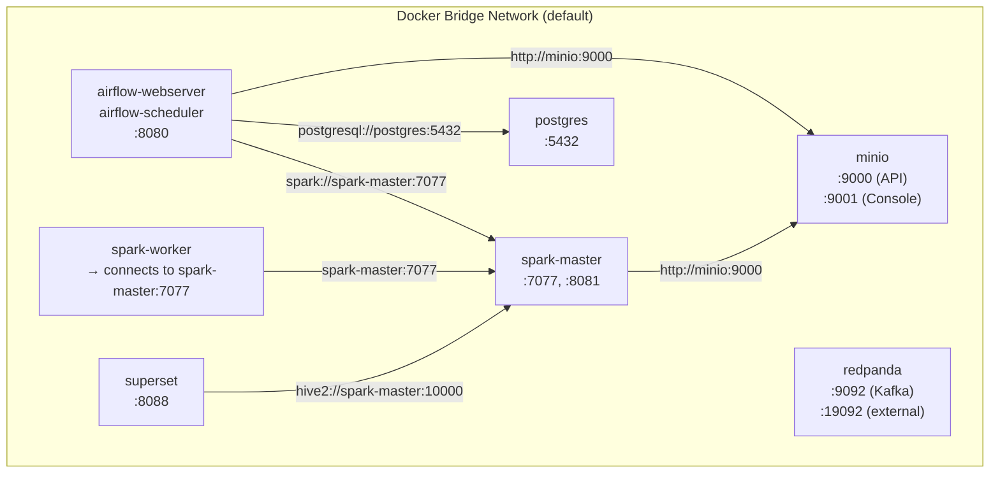

# Chapter 2: Object Storage & Infrastructure

*← [Back to Index](./index.md)*

---

## 2.1 Why Object Storage at All?

The first infrastructure question I had to answer was: *where does the data live?*

The obvious answer - just use a filesystem on the machine running Spark - breaks
immediately at scale. Filesystems are local to a single machine. The moment your
data grows beyond one machine's disk, or you want Spark workers on different nodes
to read the same data simultaneously, a local filesystem becomes a bottleneck or
simply doesn't work.

The standard answer in data engineering is **object storage**: systems like AWS S3,
Azure ADLS Gen2, or Google Cloud Storage. Object storage is:

- **Infinitely scalable** - adding capacity doesn't require attaching new disks to
  specific machines
- **Decoupled from compute** - Spark workers on any machine can read from the same
  S3 bucket simultaneously
- **Cheap** - an order of magnitude cheaper per GB than managed block storage or
  databases
- **Durable** - major cloud providers guarantee 11 nines of durability (99.999999999%)
  by replicating data across multiple availability zones

For local development, I use **MinIO** - an open-source, S3-compatible object storage
server that runs in a Docker container. MinIO is not a toy: it's used in production
by real companies and handles petabytes. For me, it's a zero-cost, zero-signup way
to develop code that will work identically on AWS S3 or Azure ADLS Gen2 when
deployed to the cloud.

> [!NOTE]
> **📸 TODO Screenshot**: Capture the MinIO console (http://localhost:9001) showing
> the `lakehouse` bucket with the `bronze/`, `silver/`, and `gold/` prefixes visible
> in the left panel.

---

## 2.2 The S3-Compatible API - What It Actually Means

"S3-compatible" sounds like marketing language, but it has a precise technical
meaning that directly affects my code.

Amazon S3 exposes a REST API for reading and writing objects. The API has well-known
endpoints: `GET /bucket/key` to read, `PUT /bucket/key` to write, `DELETE /bucket/key`
to delete, `LIST /bucket?prefix=` to list. MinIO implements this exact same API.
Azure ADLS Gen2, when accessed via the Hadoop connector, also exposes this API.

The consequence is that this line of code in
[`scripts/transform_bronze_to_silver.py`](../scripts/transform_bronze_to_silver.py):

```python
silver_path = "s3a://lakehouse/silver/retail_transactions"
df_cleaned.write.format("delta").mode("append").save(silver_path)
```

works against MinIO locally, AWS S3 in production, and ADLS Gen2 on Azure with
**zero code changes**. The only thing that changes is the Spark configuration:

```python
# Local (MinIO)
.config("spark.hadoop.fs.s3a.endpoint", "http://minio:9000")
.config("spark.hadoop.fs.s3a.access.key", "minioadmin")

# Azure (ADLS Gen2)
.config("spark.hadoop.fs.s3a.endpoint", "https://youraccount.dfs.core.windows.net")
.config("spark.hadoop.fs.s3a.access.key", "<azure-storage-key>")
```

This portability is the actual skill being demonstrated - not "I configured MinIO"
but "I understand object storage semantics well enough to write code that works
against any S3-compatible implementation."

> [!TIP]
> **Interview Answer**: S3-compatible means the system implements Amazon S3's REST
> API exactly - same HTTP verbs, same authentication scheme, same error codes.
> Any client that speaks S3 (Spark's S3A connector, the AWS CLI, boto3) works
> against MinIO, ADLS Gen2, or GCS without code changes. This is why we can develop
> locally on MinIO and deploy to Azure with only a configuration change - the
> pipeline logic doesn't know or care which storage backend it's talking to.

---

## 2.3 Object Storage Semantics - There Are No Real Folders

This is one of the most common misconceptions about object storage, and it comes
up in interviews.

When you look at the MinIO console and see a "folder" called `bronze/`, that folder
does not exist. There is no directory. Object storage is a **flat key-value store**:
every object has a key (a string), and the keys are stored in a single flat namespace
within a bucket.

What looks like a folder is just a **key prefix**. The object at
`bronze/2026-07-07/online_retail_II.csv` is stored as a single object with the
key string `bronze/2026-07-07/online_retail_II.csv`. The forward slashes are part
of the key name, not a directory separator. The console (and most tools) display
keys with slashes as if they were directory trees, because that's useful for humans.
But this is purely a display convention.

Why does this matter for engineering?

**Listing is expensive.** On a real filesystem, listing a directory is O(1) - the
OS maintains a directory entry. On object storage, listing all objects with a prefix
requires scanning every key in the bucket. At scale (millions of objects), this is
a real cost and latency concern. This is why Delta Lake maintains its own `_delta_log`
directory (Chapter 5) - so Spark doesn't have to list thousands of Parquet files
to understand the table structure.

**Atomic renames don't exist.** On a filesystem, `mv file.tmp file.parquet` is
atomic - it either succeeds or fails, there's no intermediate state. On object
storage, there's no rename operation. You copy the object to the new key and delete
the old one - two separate operations. If the process crashes between them, you
have both objects. This is why writing a Delta table is transactional via the
`_delta_log`, not via filesystem renames.

**Deletes are not instant.** On some object storage systems, deleted objects are
actually hidden rather than immediately removed. S3's eventual consistency model
(before strong consistency was added in 2020) meant that a deleted object could
still be returned by LIST operations for a brief period.

> [!TIP]
> **Interview Answer**: Object storage is a flat key-value store. "Folders" are
> just key prefixes - the slash in `bronze/2026-07-07/file.csv` is part of the
> key string, not a directory separator. This matters for three reasons: listing
> by prefix is a full scan (not an O(1) directory read), atomic renames don't
> exist (which is why Delta Lake uses a transaction log instead), and deletes
> have different semantics than filesystem deletes.

---

## 2.4 Why Docker Compose Over Native Installation

I could have installed Spark, Airflow, MinIO, Redpanda, and Postgres directly on
my Arch Linux machine. Here's why I didn't:

**Dependency isolation.** Airflow requires Python 3.8+. Spark requires a specific
JVM version. Redpanda has its own binary. Postgres has its own data directory.
Installing all of these natively on one machine produces a tangle of shared
libraries, PATH conflicts, and Python virtual environments that are miserable to
debug. When something breaks, it's impossible to tell if it's the Airflow code
or something the Spark installation corrupted.

With Docker, each service lives in its own container with its own isolated filesystem,
Python environment, and system libraries. The Spark container can use Java 11 while
another service could theoretically use Java 17 - they'd never conflict.

**Reproducibility.** Anyone (a teammate, a recruiter, a future me) can clone the
repo and run `docker compose up` to get an identical environment. There's no
"install these 8 things in exactly this order" setup guide needed. The entire
infrastructure is defined in [`docker-compose.yml`](../docker-compose.yml).

**Port forwarding for free.** Docker maps container ports to host ports. The Airflow
web UI at `8080` in the container becomes `localhost:8080` on my machine. The Spark
Master UI at `8080` in its container gets remapped to `8081` (to avoid collision):

```yaml
# docker-compose.yml (lines 85-87)
spark-master:
  ports:
    - "8081:8080"  # host:container - map Spark's 8080 to host 8081
    - "7077:7077"  # Spark master protocol port
```

**The danger of putting everything in one container.** The alternative to
`docker-compose.yml` is a single Dockerfile that runs all services. This is
almost always wrong:

- If Spark crashes, it takes Airflow down with it (no fault isolation)
- You can't scale workers independently (can't add a second Spark worker without
  changing the Dockerfile)
- Logs from all services are mixed together
- You can't restart one service without restarting all of them
- Container orchestrators (Kubernetes) are designed for one-process-per-container;
  a multi-service container is a dead end architecturally

Docker Compose gives you the isolation benefits of containers without losing the
ability to define how they talk to each other.

> [!TIP]
> **Interview Answer**: Docker Compose over native installation because of
> dependency isolation, reproducibility, and fault isolation. Each service has its
> own container with its own libraries and configuration. A single-container
> approach - running Spark, Airflow, and MinIO in one Docker image - eliminates
> these benefits: one crash takes everything down, scaling is impossible, and logs
> are an unreadable mix. Docker Compose defines the entire infrastructure as code,
> which means anyone can reproduce the environment with a single command.

---

## 2.5 Docker Networking - How Services Find Each Other

In [`docker-compose.yml`](../docker-compose.yml), all services are on the same
Docker bridge network (Docker Compose creates a default network for the entire
`docker-compose.yml`). Within this network, each container can reach other
containers by their **service name** as the hostname.

This is how Airflow talks to MinIO:

```python
# dags/bronze_ingestion.py (line 22)
s3_client = boto3.client(
    "s3",
    endpoint_url="http://minio:9000",  # "minio" is the Docker service name
    ...
)
```

And how Airflow submits jobs to Spark:

```python
# dags/bronze_ingestion.py (lines 57-68)
task_3 = SparkSubmitOperator(
    conn_id="spark_default",
    application="/opt/airflow/scripts/transform_bronze_to_silver.py",
    conf={"spark.master": "spark://spark-master:7077"}  # "spark-master" is the service name
)
```

And how Spark connects to MinIO from inside its own container:

```python
# scripts/transform_bronze_to_silver.py (line 13)
.config("spark.hadoop.fs.s3a.endpoint", "http://minio:9000")
```

The key insight: none of these use `localhost`. They use service names because
Docker's internal DNS resolves `minio` to the IP of the MinIO container on the
bridge network. `localhost` would resolve to the container itself, not to another
container.



> [!NOTE]
> **📸 TODO Screenshot**: Run `docker ps` in the terminal and capture the output
> showing all containers running with their port mappings. This demonstrates the
> whole stack is live.

---

## 2.6 Named Volumes vs. Bind Mounts

The [`docker-compose.yml`](../docker-compose.yml) uses both strategies, for
different reasons:

**Named volumes** (e.g., `minio-data`, `postgres-data`):
```yaml
volumes:
  minio-data:
  postgres-data:
  redpanda-data:
```
Docker manages these volumes internally. They persist across container restarts
(`docker restart minio` doesn't lose the data). You don't need to know the actual
path on the host. The tradeoff: you can't easily edit the files directly - you have
to `exec` into the container or use `docker cp`.

**Bind mounts** (e.g., the Airflow DAGs and scripts):
```yaml
# x-airflow-common section
volumes:
  - ./dags:/opt/airflow/dags
  - ./data:/opt/airflow/data
  - ./scripts:/opt/airflow/scripts
```
These map a specific host directory to a path inside the container. The primary
benefit: **live editing**. When I edit `dags/bronze_ingestion.py` on my machine,
the change is immediately visible inside the Airflow container without rebuilding
the image. For code that I'm actively developing, bind mounts are essential.

The rule of thumb I use:
- **Named volumes** for data that the service owns and manages (database files,
  MinIO objects, Redpanda log segments) - I don't need to see these files directly.
- **Bind mounts** for code I'm writing and running - I need the edit-run-debug
  loop to be fast, and rebuilding an image for every DAG change would be unbearable.

> [!TIP]
> **Interview Answer**: Named volumes are managed by Docker and survive container
> restarts without exposing the data directly to the host filesystem - good for
> databases and storage that the service owns. Bind mounts expose a host directory
> inside the container - good for code under active development because changes
> are immediately reflected without rebuilding the image. In our setup: MinIO and
> Postgres use named volumes (data integrity, don't need to edit), Airflow DAGs
> use bind mounts (actively developed, need the edit-refresh loop).

---

## 2.7 Secrets Management via `.env`

The [`docker-compose.yml`](../docker-compose.yml) references environment variables
rather than hardcoding credentials:

```yaml
minio:
  environment:
    MINIO_ROOT_USER: ${MINIO_ROOT_USER}
    MINIO_ROOT_PASSWORD: ${MINIO_ROOT_PASSWORD}
```

These are defined in a [`.env`](../.env) file in the project root, which is listed
in [`.gitignore`](../.gitignore). This ensures credentials never appear in version
control.

The `.env` file looks like:
```
MINIO_ROOT_USER=minioadmin
MINIO_ROOT_PASSWORD=miniopassword
POSTGRES_USER=airflow
POSTGRES_PASSWORD=airflow
POSTGRES_DB=airflow
AIRFLOW_ADMIN_USER=admin
AIRFLOW_ADMIN_PASSWORD=admin
```

Docker Compose automatically loads `.env` from the same directory as
`docker-compose.yml` when you run `docker compose up`.

In production, you'd use a secrets manager (AWS Secrets Manager, Azure Key Vault,
HashiCorp Vault) and inject secrets at runtime, never storing them in any file
at all. For a local portfolio project, the `.env` approach is appropriate - the
credentials are development-only dummy values anyway.

> [!TIP]
> **Interview Answer**: We use a `.env` file that's gitignored. Docker Compose
> reads it automatically and substitutes the values into the YAML at runtime.
> Credentials never touch version control. In production, I'd replace this with
> a secrets manager - the application code would be identical, but instead of
> reading from `.env`, Docker would inject secrets from Key Vault or Secrets Manager
> at container startup. The `.env` approach is a local-dev pattern, not a
> production one.

---

## 2.8 Healthchecks and Dependency Ordering

The services in this stack have a specific startup order: Postgres must be ready
before Airflow can initialize (because Airflow stores its metadata in Postgres).
MinIO must be ready before any Spark job runs (because the jobs immediately try
to read/write from S3).

Docker Compose handles this with `depends_on` + `healthcheck`:

```yaml
# docker-compose.yml (lines 15-17)
airflow-webserver:
  depends_on:
    postgres:
      condition: service_healthy
```

```yaml
# postgres healthcheck (lines 51-54)
healthcheck:
  test: ["CMD", "pg_isready", "-U", "${POSTGRES_USER}"]
  interval: 5s
  retries: 5
```

```yaml
# minio healthcheck (lines 34-38)
healthcheck:
  test: ["CMD", "curl", "-f", "http://localhost:9000/minio/health/live"]
  interval: 30s
  timeout: 20s
  retries: 3
```

Without healthchecks, Docker Compose's `depends_on` only waits for a container
to *start* - not for the service inside it to be *ready*. Postgres starts its
container in milliseconds, but the Postgres server takes a few seconds to be
ready to accept connections. If Airflow starts before Postgres is ready, the
database migration fails and Airflow enters a crash loop.

The `service_healthy` condition means: wait until the healthcheck passes, not
just until the container is running. This is critical for database-dependent
services.

> [!TIP]
> **Interview Answer**: `depends_on` with `condition: service_healthy` waits for
> the dependency's healthcheck to pass, not just for its container to start. A
> Postgres container can be "started" (the process exists) but not yet "healthy"
> (accepting connections). Without healthchecks, Airflow would try to connect to
> Postgres before it's ready, fail its database migration, and crash-loop.
> Healthchecks make the dependency declaration meaningful.

---

## 2.9 What Happens When Docker Host Runs Out of Disk?

MinIO stores data in a named volume (`minio-data`), which lives on the Docker host's
filesystem. If the host disk fills up, MinIO's write operations fail - new objects
can't be ingested.

But here's the important point: **immutability doesn't protect you from disk exhaustion**.
An immutable storage system (one that appends new files rather than modifying
existing ones) actually uses *more* disk over time, not less. Delta Lake in particular
accumulates old Parquet snapshots until you run `VACUUM` to remove files no longer
referenced by the transaction log.

What disk exhaustion looks like in practice:
- MinIO starts returning `500 Internal Server Error` on PUT operations
- Spark jobs trying to write Silver/Gold tables fail with storage errors
- Airflow marks tasks as failed
- The pipeline stops processing

The mitigation:
1. Monitor MinIO storage usage (MinIO console shows this)
2. Set a `VACUUM RETAIN 7 DAYS` schedule on Delta tables to clean up old files
3. Set a Bronze retention policy - after some period (e.g., 90 days), archive or
   delete old Bronze partitions
4. On cloud deployments, this is a non-issue because object storage is elastic -
   but you do still pay per GB, so the `VACUUM` practice matters for cost

---

## 2.10 The Problem Stories: What Actually Broke

Setting up this infrastructure was not smooth. Here's what I learned by having
things go wrong.

### Problem 23: MinIO Returning 403/400 on Direct HTTP

Early on I tried to verify that MinIO had data by making a raw HTTP request:

```python
import urllib.request
urllib.request.urlopen("http://localhost:9000/lakehouse/bronze/2026-07-07/online_retail_II.csv")
# → HTTP Error 403: Forbidden
```

The frustration here was genuine - I could see the file in the MinIO console, but
the HTTP request was rejected. The root cause: MinIO implements **AWS Signature
Version 4 authentication**. Every request to MinIO (or any S3-compatible endpoint)
must include a cryptographic signature derived from your access key, secret key,
the request method, the URI, and a timestamp. A bare `urllib` GET has none of that.

The fix was to stop using bare HTTP and use tools that handle auth:

```bash
# MinIO's own CLI tool - handles auth automatically
docker exec minio bash -c "mc alias set local http://localhost:9000 minioadmin miniopass && mc ls local/lakehouse/gold/ --recursive"
```

Or use boto3, which handles the signature automatically:
```python
import boto3
s3 = boto3.client('s3', endpoint_url='http://localhost:9000',
                  aws_access_key_id='minioadmin', aws_secret_access_key='miniopass')
response = s3.get_object(Bucket='lakehouse', Key='bronze/2026-07-07/online_retail_II.csv')
```

The lesson: object storage is not a web server you can curl without auth. It's an
API with a cryptographic authentication scheme. Understanding AWS Signature V4 -
even at a high level - is useful context when debugging S3 connectivity issues.

### Problem 14 + 12: Minimal Docker Images Have No Tools

The Bitnami Spark image is minimal - no `curl`, no `netstat`, no `ss`, no `wget`.
When I needed to verify what port the ThriftServer was listening on:

```bash
docker exec spark-master netstat -tlnp
# OCI runtime exec failed: exec: "netstat": executable file not found in $PATH
```

The workaround that actually works on any Linux system, even a minimal container,
is to read the kernel's TCP table directly from `/proc`:

```bash
docker exec spark-master cat /proc/$(pgrep -f HiveThriftServer2)/net/tcp
```

The output is hex-encoded IP:port pairs (e.g., `0100007F:2710` = `127.0.0.1:10000`).
Not pretty, but it works without installing anything.

For port connectivity testing, bash has a built-in TCP test:
```bash
timeout 3 bash -c 'echo >/dev/tcp/127.0.0.1/10000' && echo "Port open" || echo "Closed"
```

This is a zero-dependency port probe that works in any bash environment.

The broader lesson: when debugging containers, assume the image has almost nothing
installed. Learn the `/proc` filesystem and bash builtins - they're always there.

---

## Summary: What Chapter 2 Answers

| Question | Short Answer |
|---|---|
| Why MinIO/S3 over local filesystem? | Decoupled from compute, infinitely scalable, cheap, S3-compatible API means no code changes for cloud |
| What does S3-compatible mean? | Same REST API as AWS S3 - any S3 client works against MinIO, ADLS Gen2, or GCS |
| Why are there no real folders? | Object storage is a flat key-value store; "folders" are just key prefixes, a display convention |
| Why Docker Compose? | Dependency isolation, reproducibility, fault isolation per service |
| Single container vs. multi-service? | Multi-service = fault isolation, independent scaling, clear process boundaries |
| How do containers find each other? | Docker's internal DNS resolves service names to container IPs on the bridge network |
| Named volumes vs. bind mounts? | Named volumes for data services own; bind mounts for code under active development |
| How are secrets handled? | `.env` file that's gitignored; Docker Compose substitutes values at runtime |
| What do healthchecks do? | Ensure dependencies are *ready*, not just *started* - prevents crash-loops on startup |

---

*Next: [Chapter 3 - Orchestration with Apache Airflow](./ch3_airflow.md)*
