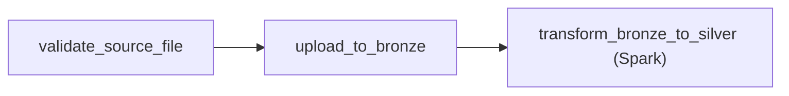

# Chapter 3: Orchestration with Apache Airflow

*← [Back to Index](./index.md)*

---

## 3.1 Why Orchestration Exists

The transformation pipeline (CSV → Bronze → Silver → Gold) is a sequence of
steps with dependencies: step 2 can't run until step 1 succeeds, step 3 can't
run until step 2 succeeds. At first glance, this sounds like a shell script:

```bash
#!/bin/bash
validate_source_file
upload_to_bronze
run_spark_job
```

That script would work - once. The problems start when you run it in production:

- The Spark job fails at 2am. Who knows? Who reruns it? For which date?
- You need to reprocess last Tuesday's data because the Silver transformation had a bug.
  How do you run *only* Tuesday's job without rerunning everything since?
- Kafka is unavailable when the script runs. The script fails silently.
  Next day's data processes, but Tuesday's is missing. Nobody notices.
- You want to see the history of which runs succeeded and which failed, for auditing.

A cron job solves the scheduling problem but none of the others. Apache Airflow
solves all of them.

Airflow is a **workflow orchestrator**: it schedules, monitors, retries, and records
the execution of data pipelines. You define pipelines as Python code (as DAGs),
and Airflow handles the rest.

---

## 3.2 What Is a DAG - And Why Directed and Acyclic?

A **DAG** is a Directed Acyclic Graph: a set of nodes (tasks) connected by directed
edges (dependencies) with no cycles.



This is the actual DAG from
[`dags/bronze_ingestion.py`](../dags/bronze_ingestion.py#L70):

```python
task_1 >> task_2 >> task_3
```

**Why Directed?** Dependencies have direction. `transform_bronze_to_silver` depends
on `upload_to_bronze`, not the other way around. The arrow points from dependency
to dependent. Airflow uses this direction to determine execution order.

**Why Acyclic?** A cycle would mean "task A depends on task B which depends on
task A" - there would be no valid starting point. Acyclic means there's always
a topological sort - an order in which you can execute all tasks such that every
task's dependencies have run before it runs. This is a mathematical property that
makes the execution order well-defined and finite.

> [!TIP]
> **Interview Answer**: A DAG is a graph of tasks where each edge represents a
> dependency and has a direction. "Acyclic" means no task depends on itself, even
> transitively - which guarantees a valid execution order exists. Airflow uses the
> DAG structure to determine which tasks can run in parallel, which must wait, and
> which to skip if an upstream task fails.

---

## 3.3 Walking Through the Actual DAG

The [`bronze_ingestion.py`](../dags/bronze_ingestion.py) DAG has three tasks.

**Task 1: `validate_source_file`**
```python
def validate_source_file():
    csv_path = "/opt/airflow/data/online_retail_II.csv"
    if not os.path.exists(csv_path):
        raise FileNotFoundError("Source CSV file not found.")
    return csv_path
```
This is a cheap guard: if the CSV isn't there, the whole pipeline fails fast
with a clear error message instead of a confusing Spark failure 10 minutes later.
The return value (`csv_path`) is automatically stored in XCom (more on this below).

**Task 2: `upload_to_bronze`**
```python
def upload_to_bronze(**context):
    ti = context["ti"]
    execution_date = context["ds"]
    csv_path = ti.xcom_pull(task_ids="validate_source_file")
    bronze_key = f"bronze/{execution_date}/online_retail_II.csv"
    ...
    s3_client.upload_file(Filename=csv_path, Bucket="lakehouse", Key=bronze_key)
```
This uploads the CSV to MinIO at a date-partitioned path. The `execution_date`
(`context["ds"]`) is the logical date this pipeline run represents - not necessarily
today's date (more on this in section 3.5).

**Task 3: `transform_bronze_to_silver`**
```python
task_3 = SparkSubmitOperator(
    task_id="transform_bronze_to_silver",
    conn_id="spark_default",
    application="/opt/airflow/scripts/transform_bronze_to_silver.py",
    application_args=["{{ ds }}"],
    packages="io.delta:delta-spark_2.12:3.1.0,org.apache.hadoop:hadoop-aws:3.3.4",
    conf={"spark.master": "spark://spark-master:7077"},
)
```
This submits a Spark job to the standalone Spark cluster. The `{{ ds }}` is
an Airflow template that renders the execution date string at runtime - the Spark
script receives the date as a command-line argument and uses it to construct
the Bronze path to read from.

This is a critical design pattern: **Airflow orchestrates, Spark processes**.
The Airflow worker doesn't touch the data. It submits a job to Spark and waits
for it to finish. This keeps the Airflow workers lightweight and avoids the
common mistake of running heavy computation inside an Airflow Python function.

> [!NOTE]
> **📸 TODO Screenshot**: Capture the Airflow UI graph view of `bronze_ingestion`
> DAG (http://localhost:8080/dags/bronze_ingestion/graph). Should show the three
> task boxes connected by arrows in sequence.

> [!NOTE]
> **📸 TODO Screenshot**: Capture a successful DAG run view (http://localhost:8080)
> showing all three tasks in green (success state).

---

## 3.4 XCom - Passing Data Between Tasks

XCom ("cross-communication") is Airflow's mechanism for tasks to pass small
pieces of data to each other. When a PythonOperator function returns a value,
that value is automatically stored in XCom:

```python
def validate_source_file():
    csv_path = "/opt/airflow/data/online_retail_II.csv"
    ...
    return csv_path  # automatically stored in XCom
```

The next task pulls it:

```python
def upload_to_bronze(**context):
    ti = context["ti"]  # TaskInstance object
    csv_path = ti.xcom_pull(task_ids="validate_source_file")
```

XCom values are stored in the Airflow metadata database (our Postgres container).
This is **exactly when XCom becomes dangerous**: if you try to pass a large object
through XCom - a Pandas DataFrame, a large JSON blob, a file's entire contents -
you're storing that data in Postgres. Postgres is not designed to be a data store
for multi-megabyte values, and your metadata database will bloat and slow down.

**XCom is for metadata, not data.** A file path (like `csv_path` here) is perfect -
it's a tiny string. A Spark DataFrame? Never. A 100,000-row CSV? Never.

For large data, the pattern is: write the data to object storage (MinIO/S3), then
pass the *path* via XCom. The downstream task reads from storage, not from XCom.

> [!TIP]
> **Interview Answer**: XCom is Airflow's inter-task communication mechanism,
> backed by the metadata database (Postgres). It's suitable for small values:
> file paths, record counts, status flags. It's dangerous for large data because
> you're storing it in the orchestration database, not a data store. The correct
> pattern for large data: write to S3, pass the S3 path via XCom, read from S3
> in the downstream task.

---

## 3.5 `execution_date` vs. `data_interval_end`

This distinction trips up almost everyone who starts with Airflow.

**`execution_date`** (also called `logical_date` in Airflow 2.x) is the
**start of the time interval** the DAG run represents. It is *not* the time the
run actually executes.

For a daily DAG scheduled to run at midnight:
- The run for July 7th data executes on July 8th at midnight
- The `execution_date` is `2026-07-07` (the interval start)
- The run actually processes data *from July 7th*

**`data_interval_end`** is the end of the interval - in this case, `2026-07-08`.

For our Bronze ingestion, we use `context["ds"]` which formats `execution_date`
as `YYYY-MM-DD`. When the DAG runs at midnight on July 8th, `ds` = `2026-07-07`,
and the Bronze path becomes `bronze/2026-07-07/`. This is correct - we're
ingesting data *for* July 7th, even though the run happens on July 8th.

```mermaid
timeline
    title Airflow Execution Timeline (daily @midnight)
    section July 7
        10:00 PM : Orders placed (source system)
        11:59 PM : Data accumulates in source
    section July 8
        12:00 AM : DAG run triggers (execution_date = 2026-07-07)
        12:01 AM : File uploaded to bronze/2026-07-07/
        12:05 AM : Spark job completes
```

Why does this matter? If I used `datetime.today()` instead of the Airflow
`execution_date` to build the Bronze path, backfilling would break. If I rerun
last Tuesday's pipeline on a Friday, `datetime.today()` would be Friday and the
data would land in `bronze/2026-07-05/` (Friday's path) instead of `bronze/
2026-07-01/` (Tuesday's path). The `execution_date` is always the logical date
of the interval, regardless of when the run actually executes.

> [!TIP]
> **Interview Answer**: `execution_date` is the logical date the run represents -
> the start of the time interval it processes. For a midnight daily DAG, the run
> that processes July 7th data runs at midnight on July 8th, but `execution_date`
> is July 7th. Using `execution_date` (not `datetime.today()`) to construct data
> paths is what makes backfilling work correctly - rerunning a historical DAG run
> processes the right interval, not today's data.

---

## 3.6 Idempotency - Can You Rerun Without Duplicating?

Idempotency means: running the same operation multiple times produces the same
result as running it once. In data pipelines, this means: **I can rerun last
Tuesday's pipeline and not get double the data in Silver**.

Our Bronze upload step achieves idempotency automatically via the date-partitioned
S3 key:

```python
bronze_key = f"bronze/{execution_date}/online_retail_II.csv"
s3_client.upload_file(Filename=csv_path, Bucket="lakehouse", Key=bronze_key)
```

If this task runs twice for the same `execution_date`, the second run overwrites
the first at the same S3 key. There's no accumulation - the Bronze path for a
given date always contains exactly one file.

The Silver write is currently `mode("append")`:

```python
df_cleaned.write \
    .format("delta") \
    .mode("append") \
    .save(silver_path)
```

This is **not** idempotent. If the Silver job runs twice for the same date,
the data gets appended twice and you have duplicates. The correct fix is to
use Delta's `MERGE` operation: "insert rows from today's Bronze partition that
don't already exist in Silver (based on `invoice_id`)." This way, a rerun
is a no-op - the records already exist.

Or use `mode("overwrite")` with a partition filter (only overwrite the partition
for today's date, not the entire Silver table).

Idempotency is one of the more important properties of a production pipeline, and
not having it in the Silver write is a known limitation of the current v1
implementation - an honest thing to say in an interview.

> [!TIP]
> **Interview Answer**: Idempotency means rerunning a pipeline produces the same
> result as running it once. Our Bronze upload is idempotent - writing to the same
> S3 key twice overwrites, not appends. Our Silver append is *not* idempotent -
> it would duplicate data on rerun. The fix is Delta MERGE (upsert on invoice_id)
> or partition-level overwrite. In production, every write in a pipeline should be
> idempotent; otherwise a legitimate retry becomes a data quality incident.

---

## 3.7 What Happens When a Task Crashes?

Airflow tracks every task's state in its metadata database (Postgres). Task states
include: `queued`, `running`, `success`, `failed`, `up_for_retry`, `skipped`.

If the Airflow worker crashes mid-execution (power outage, OOM kill, network
partition), the task stays in `running` state indefinitely - Airflow calls these
**zombie tasks**. The scheduler eventually detects that the worker heartbeat has
stopped and transitions the task to `failed`.

From there, Airflow's retry mechanism takes over:

```python
with DAG(
    dag_id="bronze_ingestion",
    default_args={"retries": 3, "retry_delay": timedelta(minutes=5)},
    ...
):
```

The task gets retried up to 3 times with a 5-minute delay. If all retries fail,
the task is marked `failed` and the downstream tasks (`upload_to_bronze` and the
Spark job) are marked `upstream_failed` - they're blocked from running until the
upstream task succeeds.

This is a fundamental advantage over cron: if a cron job fails, nothing happens.
The next night's cron runs without any awareness that yesterday failed. With
Airflow, failed tasks are visible in the UI, there's an alert mechanism, and
historical runs are preserved for audit.

---

## 3.8 Backfilling

Backfilling is re-running historical DAG runs that were missed or failed.

In our retail project, a concrete scenario: I discovered a bug in the Silver
transformation (the wrong timestamp format was being parsed, so `invoice_date`
was null for 30% of rows). I fix the bug. Now I need to reprocess the last 14
days of Bronze data through the corrected Silver transformation.

```bash
airflow dags backfill bronze_ingestion \
    --start-date 2026-06-23 \
    --end-date 2026-07-07
```

Airflow creates 14 individual DAG runs, each with its own `execution_date`,
running them in sequence (or in parallel if configured). Each run reads from
`bronze/{execution_date}/`, transforms, and writes to Silver.

Because the Bronze path is partitioned by date and we're using the `execution_date`
to construct it, backfilling is trivially correct - each run processes exactly
its own date's data, not all data mixed together.

> [!TIP]
> **Interview Answer**: Backfilling re-runs historical DAG runs for a date range.
> It's useful when a bug is found in transformation logic - you fix the bug and
> reprocess the affected date range from Bronze. Because we use `execution_date`
> (not `datetime.today()`) to build data paths, each backfill run processes exactly
> the correct historical data. Without this, backfilling would either process wrong
> data or require manual scripting.

---

## 3.9 Why Not Run Processing Inside Airflow?

A common mistake: using a PythonOperator to load a CSV into Pandas, transform
it, and write it back. This works for small data. It completely breaks at any
real scale.

Airflow workers are designed to be lightweight. They should schedule tasks,
pass metadata, trigger external systems, and monitor completion. They are *not*
designed to be compute engines.

Problems with heavy processing in Airflow workers:
- The Airflow worker is one Python process. Loading 1M rows into Pandas in a
  worker ties up the worker (it can't run other tasks)
- Workers have limited memory - a 500MB Pandas DataFrame on a worker configured
  for 256MB RAM will OOM-kill the worker process
- Airflow doesn't distribute computation - you can't use multiple workers for a
  single task
- If the worker restarts, the in-progress transformation is lost

The correct pattern (which we use): the Airflow worker submits a Spark job via
`SparkSubmitOperator`, waits for the job to complete, and reports success or failure.
The actual data processing happens on the Spark cluster, which is designed for it.

The Airflow worker's contribution to `task_3` is:
1. Format the `spark-submit` command with the right arguments
2. Submit it to the Spark master
3. Poll for completion
4. Report the exit code

That's it. The worker never touches the data.

> [!TIP]
> **Interview Answer**: Heavy data processing inside an Airflow worker is wrong
> because workers are orchestration processes, not compute engines. They have
> limited memory, no distribution capability, and tying one up with a long
> computation blocks other tasks. The correct pattern: use operators that delegate
> to purpose-built systems (SparkSubmitOperator → Spark cluster, BigQueryOperator
> → BigQuery). The Airflow worker submits and monitors; the external system does
> the work.

---

## 3.10 Airflow vs. Azure Data Factory

Since this project has a cloud track (Azure), I used both Airflow and Azure Data
Factory for the same conceptual job. The comparison is worth knowing:

| | Apache Airflow | Azure Data Factory |
|---|---|---|
| **Definition** | Python code (DAGs in version control) | GUI drag-and-drop + JSON pipelines |
| **Hosting** | Self-managed (we run it in Docker) | Fully managed Azure service |
| **Language** | Python (full flexibility) | JSON pipeline definitions |
| **Testing** | Unit-testable Python | Harder to unit test |
| **Version control** | Native (it's just .py files) | Requires ARM template export |
| **Spark integration** | SparkSubmitOperator | Native HDInsight / Databricks |
| **Cost** | $0 (self-hosted) | Pay per activity run |
| **When to use** | Engineering-heavy teams, complex logic | Enterprise Azure shops, managed infra |

The core concept is identical: both define pipelines as DAGs of tasks with
dependencies, retries, and schedules. The difference is operational: Airflow
requires you to run and maintain the scheduler; ADF is a click-to-deploy managed
service.

> [!TIP]
> **Interview Answer**: Airflow and ADF solve the same problem - pipeline
> orchestration - with different operational tradeoffs. Airflow is code-first:
> pipelines are Python files in version control, fully testable, free to run.
> ADF is managed: no infrastructure to maintain, but pipelines are JSON/GUI-based
> and harder to test rigorously. In interviews, being able to contrast them
> (because I've used both for the same pipeline) is stronger than just knowing one.

---

## 3.11 The Problem Stories: Airflow Headaches

### Problem 18: Stale SparkSubmit Processes

Every time a Spark job failed mid-run (due to missing JARs, misconfigured endpoints,
etc.), it left behind a `SparkSubmit` process on the spark-master container. These
stale processes held locks on the Derby metastore (more on Derby in Chapter 5)
and consumed memory. The next attempt would fail with a cryptic lock error rather
than the original problem.

The fix that became a habit before every Spark job attempt:

```bash
docker exec spark-master pkill -f HiveThriftServer2
docker exec spark-master pkill -f SparkSubmit
sleep 5
```

Clean state before every attempt. The lesson: when debugging distributed systems
in Docker, always check for stale processes before assuming the code is wrong.

### Problem 25: `spark-defaults.conf` Not Being Picked Up

Early on, I was passing Spark configuration as `--conf` flags directly to each
`spark-submit` command. But the `SparkSubmitOperator` in Airflow doesn't
necessarily pass all configs to a separately-started ThriftServer.

The correct approach: write all persistent Spark configuration to
`/opt/bitnami/spark/conf/spark-defaults.conf` inside the spark-master container.
This file is read on every Spark process startup - `spark-submit`, ThriftServer,
and `spark-sql` all pick it up automatically.

```bash
docker exec spark-master bash -c 'cat > /opt/bitnami/spark/conf/spark-defaults.conf << EOF
spark.jars /opt/bitnami/spark/jars/delta-spark_2.12-3.1.0.jar,...
spark.sql.extensions io.delta.sql.DeltaSparkSessionExtension
spark.hadoop.fs.s3a.endpoint http://minio:9000
...
EOF'
```

Once this was in place, every Spark process - however it was started - got the
Delta Lake and S3A configuration automatically.

### Problem 27: Spark Streaming Script Not Found on spark-master

The streaming job ([`scripts/stream_live_orders.py`](../scripts/stream_live_orders.py))
lives in the project on the host machine and is mounted into the Airflow container
at `/opt/airflow/scripts/`. But the `SparkSubmitOperator` submits the job *from*
the Airflow container and the script runs *on* the Spark cluster.

The confusion: I assumed the Spark master could find the script at the same path.
It can't - the Spark container doesn't have the bind mount. The solution is either:
- Copy the script directly into the Spark container: `docker cp stream_live_orders.py spark-master:/tmp/`
- Build the Spark image with the script included
- Use a distributed file system (HDFS or S3) and reference the script as
  `spark-submit s3a://lakehouse/scripts/stream_live_orders.py` (Spark can fetch
  the script from S3 at submit time)

For this project, copying directly to the container was sufficient.

---

## Summary: What Chapter 3 Answers

| Question | Short Answer |
|---|---|
| What is a DAG? | Directed Acyclic Graph - tasks connected by dependencies with no cycles, defining execution order |
| Why Airflow over cron? | Retries, state tracking, backfilling, observability, dependency management |
| What happens when a worker crashes? | Task moves to `failed` state via heartbeat timeout; retries if configured |
| What is execution_date? | The logical start of the time interval the run processes - not when it runs |
| What is idempotency and do we have it? | Bronze upload yes (S3 overwrite); Silver append no (would duplicate on rerun) |
| What is XCom and when is it bad? | Inter-task metadata store in Postgres; bad for large data (use S3 paths instead) |
| Why not process data in Airflow? | Workers are orchestrators, not compute; delegate heavy work to Spark |
| How does backfilling work? | Re-run historical DAG runs by date range; uses execution_date so each run processes correct interval |

---

*Next: [Chapter 4 - Distributed Compute with Apache Spark](./ch4_spark.md)*
