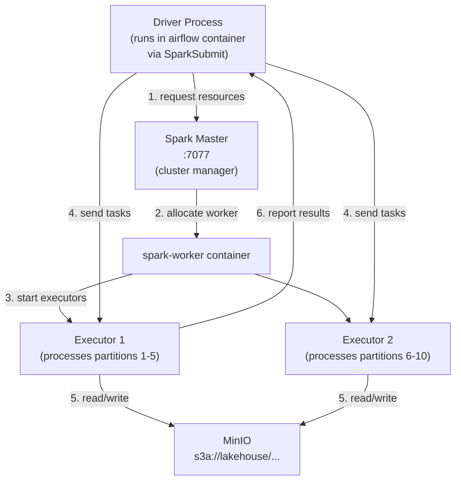
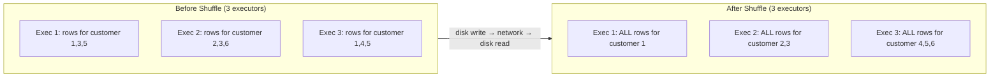

# Chapter 4: Distributed Compute with Apache Spark

*← [Back to Index](./index.md)*

---

## 4.1 Why Spark and Not Pandas?

The honest answer: for the UCI Online Retail II dataset at ~1M rows, Pandas would
work fine. My laptop could handle it. So why Spark?

Two reasons. First, the dataset is a *proxy* for a real production dataset that
might be 100M rows or 1B rows. I want to write code that would survive that growth
without being rewritten. Second, an interviewer who asks "what would happen to your
pipeline if the dataset grew 1000x?" should get the answer "nothing changes in the
pipeline code - Spark distributes the work across more executors automatically,"
not "I'd need to rewrite everything in Spark."

But the deeper reason: Pandas executes on a single machine, in a single process,
in memory. The moment your data doesn't fit in RAM, Pandas fails. Spark is designed
from the ground up for data that doesn't fit on one machine. It distributes data
across a cluster, processes partitions in parallel, and spills to disk when memory
is exhausted. These are not nice-to-haves - they're the core of what Spark is.

> [!TIP]
> **Interview Answer**: Pandas works on a single core of a single machine. Spark
> distributes work across a cluster - data is partitioned, each partition is
> processed by a separate executor, and the results are combined. For datasets that
> don't fit in memory, or queries that need to complete faster than a single machine
> allows, Spark is necessary. For a 1M-row dataset, Pandas is simpler; I use Spark
> to write code that would work unchanged at 1B rows.

---

## 4.2 The Driver and Executor Model

Every Spark application has two kinds of processes:

**The Driver** is the process that:
- Runs your `main()` function
- Creates the `SparkSession`
- Parses your transformation chain and builds a logical plan
- Communicates with the cluster manager to request resources
- Coordinates the execution of tasks
- Collects results when you call an action like `.collect()` or `.toPandas()`

In our setup, the Driver runs inside the Spark submit process (launched from the
Airflow container via `SparkSubmitOperator`). It communicates with the Spark
Master at `spark://spark-master:7077`.

**Executors** are the processes that actually process data:
- The Spark Master allocates our job to the available worker (`spark-worker` container)
- The worker starts one or more executor JVM processes
- Each executor receives task assignments from the Driver
- Executors read data from MinIO (via S3A), process their partition, and write results



**The Driver as a bottleneck.** Any operation that brings data back to the Driver
is a potential bottleneck. In [`scripts/train_churn_model.py`](../scripts/train_churn_model.py)
at line 68:

```python
df_pandas = rfm.toPandas()
```

This call moves *all* the RFM data from the executors back to the Driver process,
then converts it to a Pandas DataFrame. For 5,042 customers this is trivial. If
the dataset were 50M customers, this would move gigabytes of data to a single
process - exactly the bottleneck we were trying to avoid by using Spark.

The right fix at scale: train the model using a distributed ML framework (Spark
MLlib, or use `spark-sklearn` for scikit-learn models on Spark). For portfolio
scale, `toPandas()` is acceptable and worth being honest about.

> [!TIP]
> **Interview Answer**: The Driver coordinates execution - it builds the query plan,
> assigns tasks to executors, and collects results. Executors do the actual data
> processing on the worker nodes. The Driver is a bottleneck for operations that
> bring data back to one process: `.collect()`, `.toPandas()`, `.count()`. At
> scale, you want to keep data distributed and only bring aggregated results to
> the Driver, never raw rows.

---

## 4.3 Lazy Evaluation - The Plan vs. The Execution

This is one of the more counterintuitive things about Spark. Consider this code from
[`scripts/transform_bronze_to_silver.py`](../scripts/transform_bronze_to_silver.py):

```python
df_raw = spark.read \
    .option("header", "true") \
    .schema(raw_schema) \
    .csv(bronze_path)

df_cleaned = df_raw \
    .filter(col("Invoice").isNotNull()) \
    .withColumn("invoice_date", to_timestamp(...)) \
    .withColumnRenamed("Customer ID", "customer_id") \
    .withColumn("revenue", col("Quantity") * col("Price")) \
    .select(...)
```

When Python executes these lines, **nothing happens**. No data is read from MinIO.
No filtering runs. No type casting happens. Spark builds a *logical plan* - a
description of what transformations need to happen - but defers all actual work.

The work starts here:
```python
df_cleaned.write.format("delta").mode("append").save(silver_path)
```

`.write.save()` is an **Action** - it triggers execution. At this point Spark:
1. Takes the logical plan
2. Runs the optimizer (Catalyst) to produce a physical plan
3. Determines which partitions of the CSV to read
4. Distributes the work across executors
5. Executes all the transformations as a single pipeline pass through the data
6. Writes the output to MinIO

This deferred execution is called **Lazy Evaluation**. It enables two important optimizations:

**Predicate pushdown**: if you filter early in the chain, Spark pushes that filter
as close to the data source as possible. For Parquet files, it can skip reading
entire row groups that don't match the filter - without lazy evaluation, it would
read everything first, then filter.

**Plan optimization**: Catalyst sees the entire transformation chain before executing
any of it. It can reorder, combine, or eliminate steps in ways that no eager
execution could do.

> [!TIP]
> **Interview Answer**: Lazy evaluation means transformations build a query plan
> but don't execute until an action (like `.write()`, `.collect()`, or `.count()`)
> is called. This lets Spark's optimizer see the entire transformation chain and
> optimize it as a whole - reordering filters, combining stages, skipping
> unnecessary data reads. Without lazy evaluation, every `.filter()` would
> immediately scan the data, eliminating all optimization opportunities.

---

## 4.4 Transformations vs. Actions

Spark operations fall into two categories:

**Transformations** are lazy - they return a new DataFrame describing what to
do, without doing it:

| Transformation | What it does |
|---|---|
| `.filter(col("Invoice").isNotNull())` | Plan: exclude rows where Invoice is null |
| `.withColumn("revenue", col("Quantity") * col("Price"))` | Plan: add a computed column |
| `.withColumnRenamed("Customer ID", "customer_id")` | Plan: rename a column |
| `.select(...)` | Plan: project a subset of columns |
| `.groupBy("customer_id").agg(...)` | Plan: group and aggregate |
| `.join(other_df, on="customer_id")` | Plan: join two DataFrames |

**Actions** are eager - they trigger execution and return a result:

| Action | What it does |
|---|---|
| `.write.save(path)` | Executes the plan and writes to storage |
| `.collect()` | Executes and returns all rows to the Driver as a Python list |
| `.toPandas()` | Executes and returns all rows to the Driver as a Pandas DataFrame |
| `.count()` | Executes and returns the count of rows |
| `.show()` | Executes and prints the first N rows |

The rule: every line of Spark code that doesn't end an `.action()` is just
planning, not computing.

---

## 4.5 RDD vs. DataFrame - Why We Use DataFrames

An **RDD** (Resilient Distributed Dataset) is Spark's original low-level API.
It's a collection of objects distributed across a cluster, processed with
functional operations: `map`, `filter`, `reduce`, `flatMap`.

A **DataFrame** is a higher-level abstraction: a distributed table with named
columns and schema, processed with SQL-like operations. DataFrames use the same
underlying RDD engine but go through the Catalyst optimizer before execution.

For our retail pipeline, we always use DataFrames. Here's why:

**Schema clarity**: A DataFrame has named, typed columns. An RDD has untyped
Python objects. When I write `.withColumn("revenue", col("Quantity") * col("Price"))`,
both the column names and the arithmetic are explicit. An equivalent RDD operation
would be a lambda on tuples - cryptic and error-prone.

**Performance**: DataFrames go through Catalyst optimization. The same join
operation on a DataFrame might execute 3-5x faster than on an RDD because Catalyst
can choose the right join strategy (broadcast join, sort-merge join, etc.). RDDs
get no such optimization.

**Integration**: Delta Lake, Delta format, Structured Streaming - all of these
work with DataFrames. RDDs are a lower-level API that predates these features.

> [!TIP]
> **Interview Answer**: RDDs are Spark's untyped distributed collection API. DataFrames
> are a higher-level, schema-aware abstraction built on RDDs. We use DataFrames
> because they're optimized by Catalyst (the query planner), have named columns
> (more readable, less error-prone), and integrate with Delta Lake and Structured
> Streaming. RDDs are useful when you need fine-grained control over the data
> structure or when the data doesn't fit a tabular model - which is rare in ETL work.

---

## 4.6 Shuffle - The Most Expensive Operation (##Revise)

A shuffle occurs whenever Spark needs to redistribute data across executors.
The canonical example: `groupBy`.

When you run:
```python
rfm = df_before.groupBy("customer_id").agg(
    datediff(lit(cutoff_date), max("invoice_date")).alias("recency_days"),
    countDistinct("invoice_id").alias("frequency"),
    sum("revenue").alias("monetary")
)
```

All rows for `customer_id = "12345"` need to be on the *same* executor to be
aggregated together. But those rows might be spread across all executors from the
initial CSV read. Spark must:

1. Hash each row by `customer_id`
2. Write the rows to disk (shuffle write)
3. Send rows to the executor responsible for that hash bucket (network transfer)
4. Read the rows on the receiving executor (shuffle read)
5. Perform the aggregation

This disk write + network transfer + disk read is expensive. For a 1M-row dataset
it's fast. For a 100M-row dataset, shuffles dominate pipeline runtime.



**Broadcast variables** are the way to avoid shuffles for small datasets. If you're
joining a large orders table with a small product dimension table (say, 1,000 rows),
instead of shuffling the orders data to collocate with the products, you broadcast
the small table to *every* executor. Each executor has a local copy of the product
table and can do the join locally, no shuffle needed.

```python
from pyspark.sql.functions import broadcast
result = orders.join(broadcast(dim_product), on="product_id")
```

In our retail pipeline, `dim_product` would be a perfect broadcast candidate.

> [!TIP]
> **Interview Answer**: A shuffle is the redistribution of data across executors -
> required by operations like `groupBy`, `join`, and `sort`. It's expensive because
> it involves disk writes, network transfers, and disk reads. The mitigations:
> reduce the number of shuffles (combine groupBys where possible), use broadcast
> joins for small tables (eliminate the shuffle entirely), and control partition
> count to avoid thousands of small tasks.

---

## 4.7 Partitioning

When Spark reads a file (or a Delta table), it splits the data into **partitions** -
independent chunks that can be processed in parallel. Each partition is processed
by one executor task.

**Too few partitions**: Not enough parallelism. If you have 2 partitions and 10
executor cores, 8 cores sit idle. Processing is 5x slower than it could be.

**Too many partitions**: Overhead dominates. 10,000 partitions of 1KB each means
10,000 task launches, 10,000 scheduler interactions, 10,000 small writes to MinIO.
The overhead of managing partitions is greater than the work being done.

**The rule of thumb**: aim for 100-200MB per partition. For a 1GB file, that's
5-10 partitions. You can control this with:

```python
df = df.repartition(10)      # reshuffle into exactly 10 partitions (triggers shuffle)
df = df.coalesce(10)         # reduce partitions (no shuffle, combines existing)
```

In Spark Structured Streaming, partitioning is tied to Kafka partitions: one Kafka
partition → one Spark partition initially. This is why Kafka's partition count
directly affects streaming parallelism (covered in Chapter 6).

The `spark.sql.shuffle.partitions` config (default: 200) controls how many partitions
are created after a shuffle. For small datasets like ours, 200 is far too many -
you'd get 200 tiny files written to MinIO. Setting this to something saner:

```python
spark.conf.set("spark.sql.shuffle.partitions", "8")
```

---

## 4.8 Why Parquet (Columnar) Over CSV

Delta Lake stores data as Parquet files underneath. Understanding why Parquet is
better than CSV for analytical queries is worth being able to explain clearly.

**Row-based storage (CSV)**:

```
| Row 1: invoice_id, product_id, description, quantity, invoice_date, price, customer_id, country, revenue |
| Row 2: invoice_id, product_id, description, quantity, invoice_date, price, customer_id, country, revenue |
| Row 3: ...
```

To answer `SELECT customer_id, SUM(revenue) FROM table GROUP BY customer_id`,
the storage engine must read *every byte* of *every row* - including `description`,
`country`, and `invoice_date` - even though the query only needs two columns.

**Columnar storage (Parquet)**:

```
[column: invoice_id] [invoice_1] [invoice_2] [invoice_3]...
[column: product_id] [product_1] [product_2] [product_3]...
[column: customer_id] [cust_1] [cust_2] [cust_3]...
[column: revenue] [10.5] [22.0] [5.5]...
```

The same query reads only the `customer_id` and `revenue` columns - skipping all
others. For a 10-column table where the query needs 2 columns, that's an 80%
reduction in I/O.

Additionally, Parquet compresses each column separately, and columns of the same
type compress much better than mixed-type rows. `revenue` as doubles compresses
far better than a row interleaving a string product ID, a timestamp, and a double.

> [!TIP]
> **Interview Answer**: Parquet is columnar - it stores each column's data
> contiguously on disk. Analytical queries typically access a small subset of
> columns across many rows. With CSV, reading 2 columns from a 20-column table
> still reads all 20 columns. With Parquet, you read exactly the 2 columns you need.
> At scale this is a 10x difference in I/O, which translates directly to query
> speed and cost.

---

## 4.9 The SparkSession

Every Spark application starts with a `SparkSession`. In our code, it's created
at the top of each script:

```python
# scripts/transform_bronze_to_silver.py (lines 9-18)
spark = SparkSession.builder \
    .appName("BronzeToSilver-Deduplication") \
    .config("spark.sql.extensions", "io.delta.sql.DeltaSparkSessionExtension") \
    .config("spark.sql.catalog.spark_catalog", "org.apache.spark.sql.delta.catalog.DeltaCatalog") \
    .config("spark.hadoop.fs.s3a.endpoint", "http://minio:9000") \
    .config("spark.hadoop.fs.s3a.access.key", os.environ.get("MINIO_ROOT_USER", "admin")) \
    .config("spark.hadoop.fs.s3a.secret.key", os.environ.get("MINIO_ROOT_PASSWORD", "password")) \
    .config("spark.hadoop.fs.s3a.path.style.access", "true") \
    .config("spark.hadoop.fs.s3a.impl", "org.apache.hadoop.fs.s3a.S3AFileSystem") \
    .getOrCreate()
```

The `SparkSession` is:
- The entry point for creating DataFrames (`spark.read.csv()`, `spark.read.format("delta")`)
- The configuration hub (S3A endpoints, Delta extensions, memory settings)
- The connection to the cluster manager

The two Delta-specific configs are critical:
- `spark.sql.extensions = io.delta.sql.DeltaSparkSessionExtension` - enables Delta Lake
  SQL commands (`MERGE`, `VACUUM`, time travel)
- `spark.sql.catalog.spark_catalog = org.apache.spark.sql.delta.catalog.DeltaCatalog` -
  makes the default catalog Delta-aware, so `spark.read.format("delta")` works

Without these two configs, Delta tables can't be read or written. This was the cause
of several failures during setup (see Problem 13 below).

---

## 4.10 What Happens When Executors Run Out of Memory?

When a Spark executor runs out of heap memory (either from the data itself or from
the shuffle buffers), it first tries to **spill to disk** - write part of its
in-memory state to a local temp file. This is slow but not fatal.

If disk is also exhausted, the executor throws an `OutOfMemoryError` (Java's OOM)
and the task fails. Spark retries the task on another executor. If all attempts
fail, the job fails.

Common causes in our pipeline:
- `toPandas()` bringing too much data to the Driver
- A groupBy producing massive shuffle data (e.g., grouping by a high-cardinality
  column with no aggregation)
- Setting `spark.sql.shuffle.partitions` too low, creating giant partitions

Mitigations:
- Increase executor memory (`SPARK_WORKER_MEMORY=4G` in the compose file)
- Filter data earlier in the chain to reduce volume before expensive operations
- Repartition to create smaller partitions before a heavy groupBy

> [!NOTE]
> **📸 TODO Screenshot**: Capture the Spark Master UI (http://localhost:8081)
> showing the registered worker with its memory allocation (2G configured in
> `docker-compose.yml`).

---

## 4.11 The Problem Stories: Spark Configuration Nightmares

### Problem 13: Delta Lake `NoClassDefFoundError`

The most confusing failure during setup:

```
java.lang.NoClassDefFoundError: org/apache/spark/sql/delta/sources/DeltaSourceUtils$
```

The ThriftServer was starting, connections were working, but any query touching a
Delta table immediately threw this. The cause: the ThriftServer was started without
the Delta Lake JAR in its classpath.

The `--packages` flag that works for `spark-submit` (`--packages io.delta:delta-spark_2.12:3.1.0`)
downloads JARs at submission time. But `start-thriftserver.sh` doesn't support
`--packages` in the same way. The solution: download the JARs manually and place
them in Spark's `jars/` directory where they're always on the classpath:

```bash
docker exec spark-master bash -c '
cd /opt/bitnami/spark/jars
wget -q https://repo1.maven.org/maven2/io/delta/delta-spark_2.12/3.1.0/delta-spark_2.12-3.1.0.jar
wget -q https://repo1.maven.org/maven2/io/delta/delta-storage/3.1.0/delta-storage-3.1.0.jar
'
```

Then reference them in `spark-defaults.conf`:
```
spark.jars /opt/bitnami/spark/jars/delta-spark_2.12-3.1.0.jar,...
```

The lesson: `--packages` is a convenience for development; for any permanently
running Spark process, pre-download JARs and put them on the default classpath.

### Problem 15: `pkill -f java` Killed the Master

This was a painful one. I was trying to kill a stuck ThriftServer process:

```bash
docker exec spark-master pkill -f java
```

`pkill -f java` kills every process whose command line contains "java" - including
the Spark Master daemon, which is also a Java process. The Master daemon is typically
PID 1 in the container (the process Docker started). Killing PID 1 exits the container.

```
Error response from daemon: container <id> is not running
```

The fix: always target the specific process:

```bash
# WRONG: kills everything Java
docker exec spark-master pkill -f java

# RIGHT: kills only the ThriftServer
docker exec spark-master pkill -f HiveThriftServer2

# RIGHT: kills only SparkSubmit processes
docker exec spark-master pkill -f SparkSubmit
```

And if the container exits, restart it before doing anything else:
```bash
docker start spark-master
sleep 10  # wait for the master to re-register
```

---

## Summary: What Chapter 4 Answers

| Question | Short Answer |
|---|---|
| Spark vs. Pandas? | Spark distributes across a cluster; Pandas is single-machine. Spark scales; Pandas doesn't. |
| Driver vs. Executor? | Driver coordinates; Executors process data. Driver bottlenecks when data moves back to it. |
| Lazy evaluation? | Transformations build a plan; actions trigger execution. Enables optimizer to see the full chain. |
| RDD vs. DataFrame? | DataFrames are schema-aware, Catalyst-optimized, and integrate with Delta/Streaming. Prefer DataFrames. |
| What is a shuffle? | Data redistribution across executors - triggered by groupBy/join. Disk + network I/O = expensive. |
| Parquet vs. CSV? | Columnar (Parquet) reads only queried columns; row-based (CSV) reads all columns. 10x I/O difference at scale. |
| What does SparkSession do? | Entry point, config hub, cluster connection. Missing Delta configs → NoClassDefFoundError. |
| OOM on executors? | Spark spills to disk first; then task fails and retries. Root causes: large toPandas(), bad partitioning. |

---

*Next: [Chapter 5 - Delta Lake: ACID on Object Storage](./ch5_delta_lake.md)*
