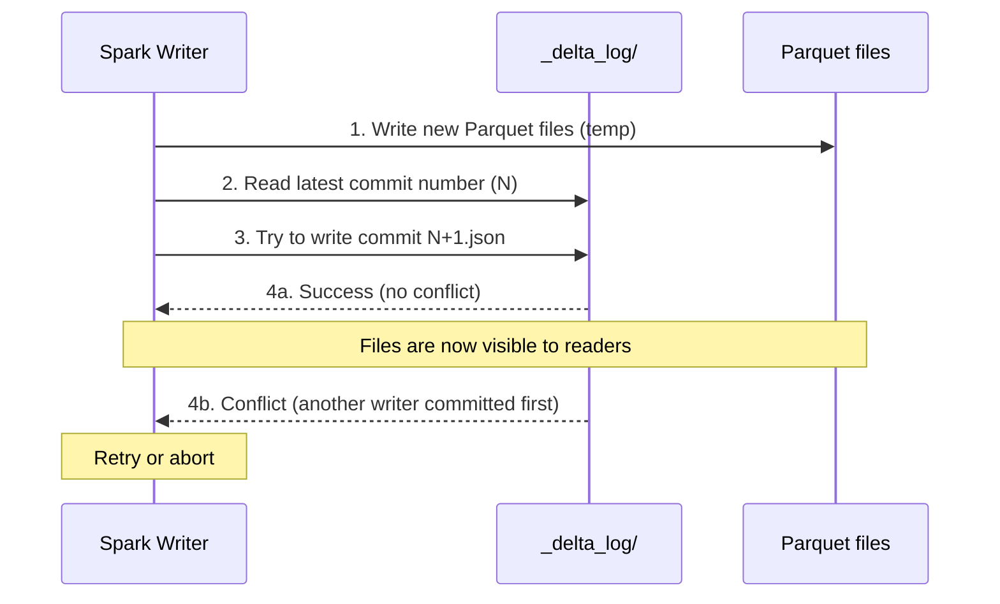
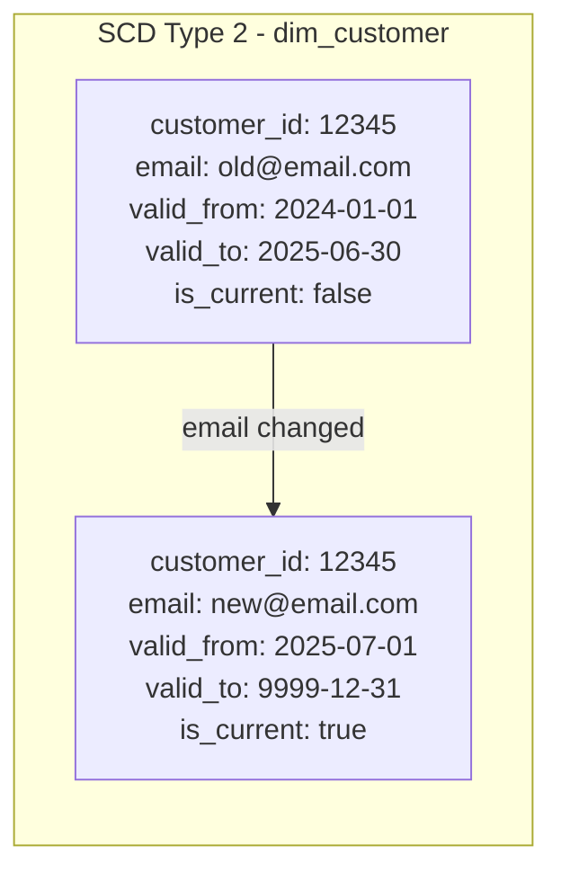

# Chapter 5: Delta Lake - ACID Transactions on Object Storage

*← [Back to Index](./index.md)*

---

## 5.1 The Problem Delta Lake Solves

Plain Parquet files on object storage have a fundamental problem: they're immutable
blobs. You can write a new Parquet file. You can delete one. But you can't update
a specific row. And you can't guarantee that a reader sees a consistent view of
the data while a writer is in the middle of writing new files.

Concretely, imagine this scenario:

1. Your nightly Spark job starts writing the updated Silver table (10 new Parquet files)
2. Halfway through, the job has written 5 of 10 files
3. An analyst runs a Superset query against Silver at this moment
4. They read 5 old files + 5 new files - a mix of yesterday's and today's data

This is a **dirty read**. The analyst sees corrupted, inconsistent data. In a
database, this can't happen - transactions prevent it. On plain Parquet on S3, there's
no transaction mechanism. Delta Lake adds one.

Delta Lake is a **table format** layered on top of Parquet files and object storage.
It adds:
- **ACID transactions**: atomic writes, consistent reads, isolation between readers
  and writers, durable commits
- **MERGE (upsert) semantics**: update specific rows without rewriting entire files
- **Schema enforcement**: reject writes that don't conform to the table schema
- **Time travel**: query historical versions of the table
- **Scalable metadata**: the transaction log replaces slow directory listings

> [!TIP]
> **Answer - Why choose Delta Lake instead of plain Parquet on object storage?**
> Plain Parquet on object storage is highly efficient for read-heavy append-only log analytics, but exhibits severe anti-patterns when updates, deletions, or transactions are required:
> 
> 1. **Lack of ACID Guarantees:** Without a transaction log, parallel Spark writers can lead to partial or dirty reads. Delta Lake maintains a JSON transaction log (`_delta_log/`) ensuring atomicity and consistency.
> 2. **Deduplication and Upsert Latency:** In retail pipelines, customer records or order statuses require deduplication or status changes. Doing this on raw Parquet requires reading the entire partition, running the updates, and overwriting all files. Delta Lake provides SQL **`MERGE` (upsert)** semantics natively on top of ADLS Gen2/MinIO, altering only the impacted Parquet files and marking outdated files as logically deleted.
> 3. **Schema Enforcement:** Delta Lake acts as a gateway, rejecting writes containing unexpected columns or invalid schemas, saving downstream consumers from silent parse crashes.

---

## 5.2 The `_delta_log` - What Makes Delta ACID

Every Delta table is a directory on object storage containing two things:
1. **Parquet data files** - the actual data
2. **`_delta_log/` directory** - the transaction log

```
s3a://lakehouse/silver/retail_transactions/
├── _delta_log/
│   ├── 00000000000000000000.json   ← commit 0: initial write
│   ├── 00000000000000000001.json   ← commit 1: next append
│   ├── 00000000000000000002.json   ← commit 2: schema change
│   └── 00000000000000000010.checkpoint.parquet  ← checkpoint (every 10 commits)
├── part-00000-abc123.snappy.parquet
├── part-00001-def456.snappy.parquet
└── part-00002-ghi789.snappy.parquet
```

Each `.json` file in `_delta_log` is a commit entry. It records:
- Which Parquet files were **added** in this commit
- Which Parquet files were **removed** (logically deleted)
- The table schema at this point
- The timestamp and commit metadata

When Spark reads a Delta table, it reads the `_delta_log` first to determine:
- Which Parquet files are part of the *current* version of the table
- What schema to use for reading

This is what enables ACID:

**Atomicity**: A write produces a new `.json` commit file atomically. Either the
commit file exists (write succeeded) or it doesn't (write failed). There's no
partial state. Even if the Spark job wrote 9 of 10 Parquet files and then crashed,
without a commit file in `_delta_log`, those 9 files are invisible to readers.

**Consistency**: Readers always read a complete, committed version. They check the
`_delta_log` and see only files that were part of a successful commit.

**Isolation**: Delta uses **optimistic concurrency control**. Multiple writers can
attempt concurrent writes. When a write commits, it checks if the log has changed
since the transaction started. If it has (another writer committed in between),
the write is retried or fails with a conflict error.

**Durability**: Once a commit file lands in `_delta_log`, it's durable - object
storage replicates it across multiple physical locations.



> [!TIP]
> **Interview Answer**: The `_delta_log` is a transaction log - a sequence of
> JSON commit files, one per write operation. Each commit records which Parquet
> files were added or removed. Readers always check the log first to determine
> which files make up the current table version. This gives atomic writes (a
> commit either exists or doesn't), consistent reads (readers only see committed
> data), and the ability to reconstruct historical versions by replaying the log.

---

## 5.3 Is Delta Lake a Database or a File Format?

**A table format.** Not a database, not just a file format. The distinction matters.

A **database** (like Postgres) manages its own storage, has a query optimizer,
handles connections, manages memory, and controls access. You can't bypass it.

A **file format** (like CSV or Parquet) is a specification for how bytes are
laid out on disk. There's no concept of transactions or consistency.

Delta Lake is a **table format**: a specification for how to organise files on
object storage to provide table-like semantics (schema, transactions, time travel)
*without* being a database. There's no Delta Lake server. There's no query planner
in Delta Lake itself. Delta Lake just specifies the layout of `_delta_log` and
the rules for reading and writing files.

The query engine (Spark) reads Delta format tables. The storage engine (MinIO/S3)
stores the files. Delta Lake is the specification that connects them.

This also means Delta Lake has no central bottleneck. There's no Delta Lake server
to scale up. Multiple Spark clusters can read the same Delta table simultaneously
because they're all just reading files from object storage according to the spec.

> [!TIP]
> **Interview Answer**: Delta Lake is a table format, not a database. A database
> has a server that manages storage and handles queries. Delta Lake is a specification
> for organising Parquet files and a transaction log on object storage. There's no
> Delta Lake server - Spark (or other engines like Trino) implements the Delta
> protocol to read and write conforming tables. The distinction matters because
> Delta Lake has no central bottleneck or single point of failure at the storage layer.

---

## 5.4 MERGE - Upserting Without Overwriting

The classic problem: you receive a correction to a customer record. `customer_id = 12345`
had an incorrect email in yesterday's Silver table. Today's Bronze contains the
corrected record.

**With plain Parquet**: You'd have to rewrite the entire Silver table. Every row
from every Parquet file, reconstructed with the one corrected row, written to new
files. This is a full table scan and rewrite - O(n) regardless of how many rows
changed.

**With Delta Lake MERGE**: You write only what changed.

```sql
MERGE INTO silver.retail_transactions AS target
USING new_data AS source
ON target.invoice_id = source.invoice_id
WHEN MATCHED THEN UPDATE SET *
WHEN NOT MATCHED THEN INSERT *
```

Delta identifies which Parquet files contain the matching rows, rewrites only
those files with the updated data, and records the change in `_delta_log`. For
a 1M-row table with 1 corrected record, you might rewrite 1 or 2 Parquet files
instead of all of them.

In our Silver write, we currently use `mode("append")` which doesn't check for
existing records - it just appends. This is intentional for v1 (the source data
doesn't send duplicate invoice IDs), but a production implementation would use
MERGE with `invoice_id` as the match key to prevent duplicates from backfill
reruns (see Chapter 3 on idempotency).

The difference between MERGE and INSERT OVERWRITE:

| | Delta MERGE | INSERT OVERWRITE |
|---|---|---|
| Granularity | Row-level | Partition-level or table-level |
| When to use | Deduplication, CDC, corrections | Full refresh of a partition |
| Overwrites existing rows? | Yes, matched rows | Yes, entire partition |
| Rewrites | Only affected files | All files in scope |
| Use case | `dim_customer` SCD Type 2 updates | Daily batch replacement |

---

## 5.5 Time Travel - The Accidental Superpower

Every Delta commit is a numbered version. Delta can query any historical version:

```python
# Read the Silver table as it was at version 5
df = spark.read.format("delta").option("versionAsOf", 5).load(silver_path)

# Or by timestamp
df = spark.read.format("delta").option("timestampAsOf", "2026-07-01").load(silver_path)
```

How would this have saved me during this project?

Imagine the Silver transformation job had a bug in the revenue calculation
(e.g., `revenue = Quantity * Price` was accidentally written as `revenue = Price`).
Three days of Silver and Gold data are now corrupted with wrong revenue numbers.

Without Delta: you'd need to reprocess from Bronze (which we'd do anyway) and
hope the old Silver data is gone. With Delta time travel:

1. Roll back Silver to the last clean version:
   ```sql
   RESTORE TABLE silver.retail_transactions VERSION AS OF 3;
   ```
2. Fix the bug in the transformation code
3. Reprocess from Bronze from the affected date range

The RESTORE command rewrites the `_delta_log` to point back to version 3's file
list. No data was deleted - the corrupted files still exist on disk, just not
referenced by the current version.

This is also useful for auditing: "what did our Silver table look like on the day
we ran the quarterly report?" - a time travel query answers this instantly.

**The catch**: storage. Every version keeps its Parquet files around until you
run `VACUUM`. If you never vacuum, you keep all historical versions forever,
and your storage costs grow without bound. The `VACUUM RETAIN 7 DAYS` command
removes files that are no longer referenced by any version in the last 7 days:

```sql
VACUUM silver.retail_transactions RETAIN 168 HOURS;  -- 7 days
```

After `VACUUM`, you lose time travel beyond 7 days, but you reclaim the disk space.

> [!TIP]
> **Interview Answer**: Delta Lake's time travel lets you query any historical
> version of a table, either by version number or timestamp. It works because
> the `_delta_log` records which files belonged to each version - Delta never
> overwrites files, it only adds new files and records the new state in the log.
> To recover from a corrupted pipeline run, you RESTORE to the last clean version.
> The tradeoff: old files accumulate until you run VACUUM, which trades history
> depth for storage cost.

---

## 5.6 Schema Enforcement and `mergeSchema`

Delta Lake enforces the table schema by default. If you try to write a DataFrame
with a new column that doesn't exist in the existing Delta table schema, the write
fails with a `AnalysisException`.

This is the behaviour at Silver: once the Silver schema is established, new data
must conform. This prevents schema drift from propagating silently from Bronze to
Silver.

In our code, we use `mergeSchema: true`:
```python
df_cleaned.write \
    .format("delta") \
    .mode("append") \
    .option("mergeSchema", "true") \
    .save(silver_path)
```

`mergeSchema: true` is a *controlled* opt-in to schema evolution. If the DataFrame
has a column that doesn't exist in the table, Delta *adds* the column to the schema
(with null values for existing rows) rather than rejecting the write.

When would you use this vs. strict enforcement?
- **Strict enforcement** (default): you want to catch schema changes as errors.
  A source adding a new column breaks your ingestion and forces an explicit decision.
- **`mergeSchema: true`**: you accept additive schema changes automatically (new
  columns are added), but type changes on existing columns still fail. Useful
  when the source occasionally adds new fields and you want them picked up without
  manual intervention.

---

## 5.7 The Small File Problem and OPTIMIZE

Every Spark write creates new Parquet files. A streaming job that triggers every
10 seconds creates a new set of files every 10 seconds. After a week, you might
have thousands of tiny (10KB) Parquet files in a Delta table.

This is the **small file problem**: listing thousands of files is slow (object storage
listing is expensive), reading each file has overhead, and the `_delta_log` itself
grows large tracking all these files.

Delta's solution: `OPTIMIZE` with optional Z-ORDER clustering:

```sql
OPTIMIZE silver.retail_transactions;
OPTIMIZE gold.live_order_metrics ZORDER BY (customer_id, invoice_date);
```

`OPTIMIZE` rewrites small files into larger ones (typically targeting 1GB per file).
`ZORDER BY` additionally sorts the data by the specified columns, which colocates
related data in the same files - so queries filtering by `customer_id` scan far
fewer files.

This should be run on a schedule (daily or weekly), typically as the last task in
the nightly pipeline:

```python
spark.sql("OPTIMIZE s3a://lakehouse/silver/retail_transactions")
spark.sql("VACUUM s3a://lakehouse/silver/retail_transactions RETAIN 168 HOURS")
```

---

## 5.8 What Happens If You Delete a Parquet File?

If you manually delete a Parquet file from the Delta table directory (say, from
the MinIO console), the Delta table may break.

Here's what happens:
1. The `_delta_log` still references the deleted file in its history
2. If the current version of the table references that file, any read that needs
   that file will fail with a `FileNotFoundException`
3. If a `VACUUM` had already been run and that file was from an old version, the
   deletion might not affect reads of the current version

The lesson: **never manually delete Parquet files from a Delta table directory**.
Use Delta's own mechanisms: `DELETE FROM` for logical row deletions (Delta handles
which files to rewrite), or `VACUUM` for physical cleanup of old, unreferenced files.

This is also why the metadata (`_delta_log`) is separate from the data files: the
log is the source of truth for what the table contains. The Parquet files without
a corresponding log reference are invisible to Delta readers - they're ghosts.

> [!TIP]
> **Interview Answer**: If you delete a Parquet file that the current Delta version
> references, reads that access that file will throw a FileNotFoundException. If
> you delete an old file already cleaned up by VACUUM, the current version is
> unaffected. The correct way to remove data from a Delta table is through Delta's
> own DELETE command (for rows) or VACUUM (for old unreferenced files). Manual
> file deletion bypasses the transaction log and breaks the consistency guarantee.

---

## 5.9 The Problem Stories: Derby, Locks, and the ThriftServer

Getting Superset to query Delta tables directly required running a Hive ThriftServer
- a JDBC endpoint that Superset could connect to, which would execute Spark SQL
queries on demand. This was the most painful part of the entire project setup.

### Problems 8, 9, 10: The Hive Metastore Rabbit Hole

**Problem 9 (ThriftServer not running)** was the entry point. Superset couldn't
connect to the Hive endpoint because the ThriftServer wasn't started - it's not
part of the Bitnami Spark image's default startup. Fix: start it manually:

```bash
docker exec -d spark-master /opt/bitnami/spark/sbin/start-thriftserver.sh
```

**Problem 8 (table not found in Hive metastore)** hit next. The Delta table
existed in MinIO, but the ThriftServer's Hive metastore (backed by Derby, an
embedded Java database) didn't know about it. You can't just `SELECT * FROM
gold.live_order_metrics` - you'd have to first register the Delta location in
the metastore with `CREATE TABLE`.

The breakthrough insight: Delta tables can be queried *by path* without metastore
registration:

```sql
SELECT * FROM delta.`s3a://lakehouse/gold/live_order_metrics` LIMIT 3;
```

The backticks wrap the S3 path, the `delta.` prefix tells Spark to use the Delta
protocol. This bypasses the Hive metastore entirely and reads straight from MinIO.
Superset's SQL Lab would accept this as a virtual dataset query.

**Problem 10 (Derby metastore locked)** was the most frustrating. Derby uses a
file lock: only one JVM can open a given Derby database at a time. When I killed
a ThriftServer ungracefully (via `pkill -f java`, or when the container was
restarted), the lock file (`/opt/bitnami/spark/metastore_db/__db.lck`) remained.
The next ThriftServer attempt would fail immediately:

```
ERROR XSDB6: Another instance of Derby may have already booted the database
```

Three-part fix:
```bash
# 1. Kill all stale Spark processes
docker exec spark-master pkill -f HiveThriftServer2
docker exec spark-master pkill -f SparkSubmit

# 2. Delete the locked metastore database
docker exec spark-master rm -rf /opt/bitnami/spark/metastore_db
docker exec spark-master rm -f /opt/bitnami/spark/derby.log

# 3. Start ThriftServer with a fresh, isolated metastore path
docker exec -d spark-master /opt/bitnami/spark/sbin/start-thriftserver.sh \
    --conf "spark.hadoop.javax.jdo.option.ConnectionURL=jdbc:derby:;databaseName=/tmp/metastore_db_clean;create=true"
```

Using `/tmp/metastore_db_clean` instead of the default path meant no residual lock
files, and if this metastore gets corrupted, deleting it is harmless (the actual
data is in MinIO, not Derby).

### Problems 11, 16, 17: ThriftServer Binding to 127.0.0.1

After the ThriftServer started successfully, Superset still couldn't connect.
The ThriftServer was listening on `127.0.0.1:10000` - only reachable from inside
the container, not from the Superset container on the Docker network.

Normally you'd fix this with:
```
spark.hive.server2.thrift.bind.host=0.0.0.0
```

But the Bitnami Spark image ignores this config. Every variation I tried - in
`spark-defaults.conf`, in `hive-site.xml`, as a `--conf` flag - was ignored.
The ThriftServer always bound to localhost.

The solution was architectural: use `socat` as a TCP proxy running inside the
spark-master container, forwarding all connections from `0.0.0.0:10000` (accessible
from the Docker network) to `127.0.0.1:10000` (where the ThriftServer was actually
listening):

```bash
# Install socat (not in the minimal image)
docker exec -u root spark-master bash -c "apt-get update -qq && apt-get install -y -qq socat"

# Start the proxy
docker exec -d spark-master socat TCP-LISTEN:10000,bind=0.0.0.0,reuseaddr,fork TCP:127.0.0.1:10000
```

This worked. Superset's connection string `hive2://spark-master:10000` now reached
the ThriftServer via the socat relay. The lesson: sometimes a config doesn't work
as documented in a specific image, and you need a workaround at the network layer.

> [!NOTE]
> **📸 TODO Screenshot**: Capture the Superset SQL Lab interface (http://localhost:8088/superset/sqllab)
> with a successful `SELECT * FROM delta.\`s3a://lakehouse/gold/live_order_metrics\`` query.

### Problem 26: The Critical Missing JAR - `hadoop-aws`

After all the ThriftServer drama, I finally had a working JDBC connection from
Superset. But any query touching MinIO would hang indefinitely:

```sql
SELECT * FROM delta.`s3a://lakehouse/gold/live_order_metrics`
-- (hangs for 60+ seconds, then times out)
```

The root cause: the S3A filesystem connector (`hadoop-aws` JAR) wasn't in the
ThriftServer's classpath. Without it, any `s3a://` URI is simply unrecognized.
Spark doesn't fail fast with "protocol not found" - it just hangs waiting for a
network response that never comes, because the S3A client was never initialized.

Fix: download and register the JAR:

```bash
docker exec spark-master bash -c '
cd /opt/bitnami/spark/jars
wget -q https://repo1.maven.org/maven2/org/apache/hadoop/hadoop-aws/3.3.4/hadoop-aws-3.3.4.jar
wget -q https://repo1.maven.org/maven2/com/amazonaws/aws-java-sdk-bundle/1.12.262/aws-java-sdk-bundle-1.12.262.jar
'
```

Add to `spark-defaults.conf`:
```
spark.jars /opt/bitnami/spark/jars/delta-spark_2.12-3.1.0.jar,...,/opt/bitnami/spark/jars/hadoop-aws-3.3.4.jar,/opt/bitnami/spark/jars/aws-java-sdk-bundle-1.12.262.jar
```

After adding these JARs and restarting the ThriftServer, the same query returned
results in **6.5 seconds**. The JAR was the entire blocker.

---

## 5.10 SCD Type 2 - Why `dim_customer` Needs It

A brief note on dimensional modeling, since the Gold layer's `dim_customer` table
uses SCD Type 2.

**SCD Type 1** (overwrite): when a customer's email changes, you update the record.
The old email is lost. Simple but lossy.

**SCD Type 2** (versioned history): when a customer's email changes, you add a new
row with the new email and mark the old row as expired. Both versions are preserved.



Why does this matter for churn analysis? If a customer changed their email on
July 1st and we're analysing their purchase history in December, we need to know
what their email was *at the time of each purchase* to correctly attribute purchases
to the right customer record. SCD Type 2 enables this "point-in-time" join.

Delta's MERGE makes SCD Type 2 practical on a lakehouse. Each nightly run:
1. Identifies changed customer records
2. MERGEs: expires the old row (`valid_to = today`, `is_current = false`), inserts
   the new row (`valid_from = today`, `is_current = true`)

Without Delta MERGE, implementing SCD Type 2 on plain Parquet would require full
table rewrites every night.

---

## Summary: What Chapter 5 Answers

| Question | Short Answer |
|---|---|
| What is `_delta_log`? | Transaction log - JSON commit files recording which Parquet files belong to each version |
| Why is Delta ACID? | Atomic commits via log entries; readers see only committed versions; optimistic concurrency for writers |
| Delta MERGE vs. INSERT OVERWRITE? | MERGE is row-level (upsert); INSERT OVERWRITE replaces an entire partition |
| What is time travel? | Query any historical version by number or timestamp; RESTORE to roll back |
| Schema enforcement vs mergeSchema? | Default rejects non-conforming writes; mergeSchema accepts additive changes (new columns) |
| Small file problem? | Streaming creates many tiny files; OPTIMIZE rewrites them into larger ones |
| Is Delta a database? | No - it's a table format (spec for file layout + transaction log). No Delta server. |
| Deleting a Parquet file manually? | Breaks reads if the current version references it. Never do this; use Delta's DELETE or VACUUM. |

---

*Next: [Chapter 6 - Streaming: Redpanda + Spark Structured Streaming](./ch6_streaming.md)*
