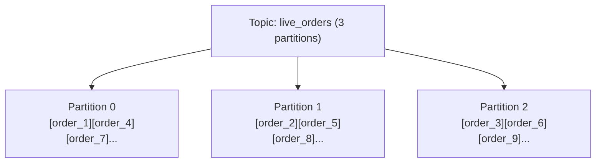
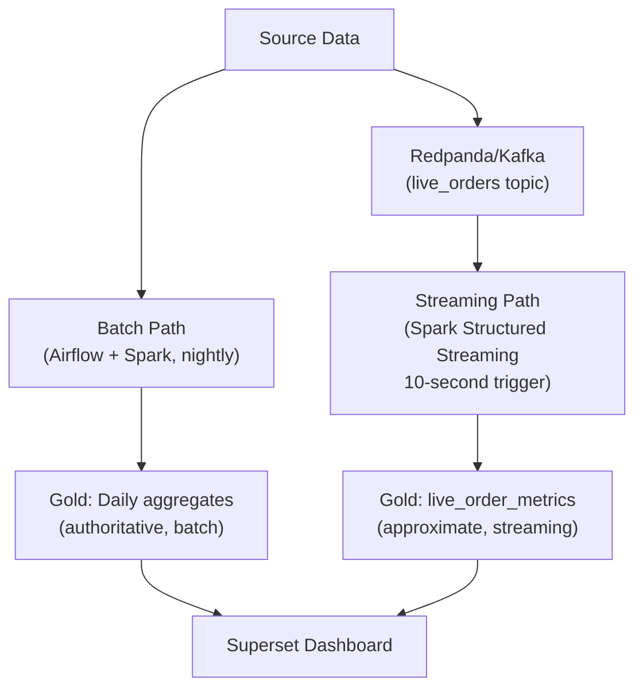

# Chapter 6: Streaming - Redpanda + Spark Structured Streaming

*← [Back to Index](./index.md)*

---

## 6.1 Why Streaming at All?

The batch pipeline (Chapter 3) runs nightly. By 6am, yesterday's Gold tables are
ready. But the operations team needs to know: *how many orders came in during the
last hour?* Yesterday's batch answer is useless. They need live data.

This is the fundamental problem streaming solves: **reducing the latency between
an event happening and the event being visible in the analytics layer** - from
hours (batch) to seconds or minutes (streaming).

The streaming path in this project:
1. A Python event generator produces synthetic orders and publishes them to
   a Redpanda topic (`live_orders`) - simulating an order management system
2. Spark Structured Streaming reads from the topic continuously
3. Every 10 seconds, the aggregate metrics (total orders, total revenue) are
   written to `gold/live_order_metrics` in Delta Lake on MinIO
4. Superset reads from this Gold table and shows a near-real-time dashboard

---

## 6.2 The Message Broker - Redpanda vs. Kafka

**Kafka** is the industry-standard log-based message broker. Understanding why
it's different from a message queue (like RabbitMQ) is a common interview question.

### Message Queue vs. Log-Based Broker

| | Message Queue (RabbitMQ) | Log-Based Broker (Kafka/Redpanda) |
|---|---|---|
| After a message is consumed... | It's deleted from the queue | It stays in the log |
| Multiple consumers of same message? | No (one consumer gets each message) | Yes (multiple consumer groups, each reading independently) |
| Replay? | No - consumed messages are gone | Yes - seek to any offset and re-read |
| Data model | Queue (FIFO, delete on read) | Append-only log (seek to any position) |
| Use case | Task distribution (job queues) | Event streaming, audit logs, replay |

For our use case, the log-based model is essential. The streaming Spark job reads
live orders. Airflow might also read from the same topic to load into Bronze. A
monitoring system might read from it for anomaly detection. With a message queue,
the first consumer to read a message claims it - the other consumers miss it.
With Kafka/Redpanda, each consumer group maintains its own offset and reads
independently.

### Partitions - The Unit of Parallelism

A Kafka topic is divided into **partitions** - ordered, immutable sequences of
records. Each partition is an independent log.



Each producer assigns records to a partition (by key hash, round-robin, or custom).
Each consumer in a group is assigned one or more partitions. The number of partitions
is the maximum degree of parallelism for consumers.

**Ordering**: Kafka guarantees order *within a partition*. If order_1 is written to
partition 0 before order_4, consumers of partition 0 always see order_1 before
order_4. But there's no ordering guarantee *across* partitions. If you need global
ordering, you need a single partition - which eliminates parallelism.

For our retail orders, per-partition ordering is sufficient. The streaming job
aggregates all orders globally; the exact order individual records arrive in doesn't
affect the aggregate.

### Consumer Offsets

An **offset** is the position of a record within a partition - its sequential ID
starting from 0. Kafka tracks which offset each consumer group has read up to.

```
Partition 0: [0][1][2][3][4][5]...
Consumer Group A: offset = 4 (has read 0-3, next is 4)
Consumer Group B: offset = 2 (has read 0-1, next is 2)
```

Offsets are stored in a special Kafka topic called `__consumer_offsets`. When a
consumer restarts after a crash, it reads its last committed offset from this topic
and resumes from there - it doesn't re-read from the beginning or skip missed messages.

Spark Structured Streaming stores offsets in its **checkpoint location** (more on
this below), not in Kafka's `__consumer_offsets`. This is how Spark tracks exactly
where it left off after a restart.

### `acks` Configuration

The `acks` setting controls when the producer considers a write successful:
- `acks=0`: fire-and-forget. No confirmation. Fastest, least durable.
- `acks=1`: leader partition confirms receipt. Moderate durability.
- `acks=all`: all replicas confirm. Slowest, most durable.

For financial-adjacent data like orders, `acks=all` is the correct choice - losing
an order event would be a real data quality issue.

### Why Redpanda and Not Kafka?

**Redpanda** is a Kafka-compatible message broker written in C++ instead of Java.
It implements the Kafka wire protocol exactly - any Kafka client (including Spark's
Kafka connector) works against Redpanda without changes.

Why use it instead of Kafka?
- **No JVM**: Redpanda runs as a single binary with no ZooKeeper dependency.
  Running real Kafka in Docker requires KRaft or ZooKeeper, multiple processes,
  and more memory.
- **Lower resource usage**: Redpanda runs acceptably in a container with 512MB
  of RAM. Kafka needs significantly more.
- **Same API**: the Spark streaming code uses `kafka.bootstrap.servers`, topic
  names, and consumer groups - identical to how it would work with real Kafka.

The skill demonstrated is the same: Kafka protocol, consumer groups, partitions,
offsets. Redpanda is just a cheaper runtime for local development.

> [!TIP]
> **Interview Answer**: Kafka/Redpanda is a log-based broker, not a message queue.
> Messages survive being read and can be replayed by multiple consumer groups
> independently. Each topic is partitioned - partitions are the unit of parallelism
> (more partitions = more consumers in parallel) and the unit of ordering (order
> is guaranteed within a partition, not across). We use Redpanda because it
> implements the Kafka protocol exactly but runs as a lightweight single binary -
> same code, same concepts, lower Docker overhead.

---

## 6.3 Walking Through `stream_live_orders.py`

The entire streaming pipeline lives in
[`scripts/stream_live_orders.py`](../scripts/stream_live_orders.py). Let's walk
through it section by section.

**Step 1: SparkSession with Delta and S3A**
```python
spark = SparkSession.builder \
    .appName("LiveOrderStreaming") \
    .config("spark.sql.extensions", "io.delta.sql.DeltaSparkSessionExtension") \
    .config("spark.hadoop.fs.s3a.endpoint", "http://minio:9000") \
    # ... S3A credentials
    .getOrCreate()
```
Same configuration as the batch jobs - Delta and S3A must be enabled.

**Step 2: Define the Schema**
```python
schema = StructType([
    StructField("Invoice", StringType(), True),
    StructField("StockCode", StringType(), True),
    StructField("Quantity", IntegerType(), True),
    StructField("InvoiceDate", StringType(), True),
    StructField("Price", DoubleType(), True),
    StructField("Customer ID", StringType(), True),
    StructField("Country", StringType(), True)
])
```
Kafka messages are raw bytes. Spark receives them as the `value` column (binary).
We need a schema to parse the JSON payload into typed columns.

**Step 3: Read from Kafka**
```python
raw_stream = spark.readStream \
    .format("kafka") \
    .option("kafka.bootstrap.servers", "redpanda:9092") \
    .option("subscribe", "live_orders") \
    .option("startingOffsets", "earliest") \
    .load()
```
`readStream` returns a streaming DataFrame - it behaves like a regular DataFrame
for transformations but triggers continuously. `startingOffsets: earliest` means:
on first run, read from the beginning of the topic. After the checkpoint is
established, this option is ignored - Spark uses the checkpoint offset.

**Step 4: Parse JSON and Type**
```python
parsed = raw_stream \
    .select(from_json(col("value").cast("string"), schema).alias("data")) \
    .select("data.*")

typed = parsed \
    .withColumn("invoice_date", to_timestamp(col("InvoiceDate"), "yyyy-MM-dd HH:mm:ss")) \
    .withColumn("revenue", col("Quantity") * col("Price")) \
    .withWatermark("invoice_date", "10 minutes")
```
The `from_json` function parses the binary `value` into structured columns.
Then we compute `revenue` and - critically - apply a **watermark**.

**Step 5: Aggregate**
```python
aggregated = typed.groupBy() \
    .agg(
        approx_count_distinct("Invoice", rsd=0.05).alias("total_orders"),
        spark_sum("revenue").alias("total_revenue"),
        spark_sum("Quantity").alias("total_items_sold")
    )
```
`groupBy()` with no arguments groups *all* records into a single global aggregate.
This produces exactly one row: the running totals across all live orders ever seen.

`approx_count_distinct` uses HyperLogLog to estimate distinct invoice counts without
tracking every invoice ID in memory - suitable for a dashboard where an approximation
within 5% (`rsd=0.05`) is acceptable.

**Step 6: Write to Delta Gold**
```python
query = aggregated.writeStream \
    .format("delta") \
    .outputMode("complete") \
    .option("checkpointLocation", "s3a://lakehouse/checkpoints/live_order_metrics") \
    .trigger(processingTime="10 seconds") \
    .start("s3a://lakehouse/gold/live_order_metrics")
```

- `outputMode("complete")`: on every trigger, write the entire result (the single
  aggregate row). Appropriate here because we're doing a global aggregation.
- `checkpointLocation`: where Spark stores offset progress and state. Stored in
  MinIO so it survives container restarts.
- `trigger(processingTime="10 seconds")`: process new Kafka records every 10 seconds
  (micro-batch mode).

---

## 6.4 Micro-Batch vs. Continuous Processing

Spark Structured Streaming has two execution modes:

**Micro-batch** (default, what we use): Spark runs a Spark job every trigger interval
(10 seconds in our case). Each job reads new records from Kafka since the last
checkpoint, processes them, and writes output. There's a latency floor equal to
the trigger interval - you can never get sub-10-second latency with a 10-second trigger.

**Continuous processing**: Spark continuously reads and processes records with
millisecond latency. But as of Spark 3.5, continuous processing has significant
limitations: it only supports simple stateless transformations (no aggregations,
no joins, no watermarking). For our pipeline with a global aggregation, continuous
processing isn't supported.

For a dashboard that shows "orders in the last 10 minutes," 10-second micro-batch
latency is entirely acceptable. Sub-second latency would require a different
architecture (Flink, or Spark continuous processing for a simpler pipeline).

> [!TIP]
> **Interview Answer**: Micro-batch processes new records in fixed time intervals
> (our trigger: 10 seconds). It's a mini-batch Spark job on each trigger - well-
> tested, supports all transformations, but has a latency floor at the trigger
> interval. Continuous processing achieves millisecond latency but only supports
> simple stateless transforms. For aggregations and stateful operations (which most
> real-world streaming jobs need), micro-batch is the correct choice.

---

## 6.5 Watermarking - Preventing Memory Overflow

Streaming aggregations need to track **state** - in our case, the running totals.
If we use event time (the `invoice_date` when the order was placed) for our
aggregations, Spark needs to keep state for every open time window until it's
certain that no more late-arriving records will come for that window.

Without a bound on lateness, Spark would keep state forever - memory grows
unboundedly until the job OOMs.

A **watermark** tells Spark: "I am willing to wait at most X time for late data.
After that, I consider the window closed and discard any state for it."

```python
.withWatermark("invoice_date", "10 minutes")
```

This says: an event with `invoice_date = 10:00` will be included in any aggregation
window that contains 10:00, but only if it arrives before `processing_time + 10 minutes`
(i.e., before 10:10 in processing time). After 10:10, Spark discards any state
for time windows that end before 10:00, freeing memory.

```mermaid
timeline
    title Watermark Effect
    section Event Time
        "10:00" : "Order placed"
        "10:05" : "Order placed (late, arrives at 10:12)"
    section Processing Time
        "10:02" : "Spark processes 10:00 order"
        "10:10" : "Watermark = 10:10 - 10min = 10:00"
        "10:12" : "Late order (10:05) arrives - still accepted (10:05 > watermark 10:00)"
        "10:22" : "Watermark advances to 10:12"
        "10:25" : "Very late order (9:55) arrives - dropped (9:55 < watermark 10:12)"
```

**What happens to a record that arrives after the watermark?** It's dropped silently.
Spark emits no error. The record is consumed from Kafka (the offset advances) but
its contribution to the aggregation is lost. This is the tradeoff: bounded memory
vs. perfect late data handling.

> [!TIP]
> **Interview Answer**: Watermarking sets a maximum lateness bound for event-time
> based aggregations. Without it, Spark keeps state for every time window forever
> (memory grows without bound). With a 10-minute watermark, Spark closes windows
> more than 10 minutes in the past and frees their state. Records arriving after
> the watermark are dropped silently. The tradeoff: bounded memory vs. missing some
> very late events.

---

## 6.6 Event Time vs. Processing Time

**Event time** is when the event actually happened - the `invoice_date` field in
our order records.

**Processing time** is when Spark processed the event - when it was read from Kafka.

These can be very different. An order placed at 9:55 PM might not reach Kafka
until 10:05 PM (network latency, batch uploads from the POS system). If we're
building a "10:00 PM sales total" dashboard metric:

- With **processing time**: we'd include the 9:55 PM order in the 10:05 PM bucket
  (wrong - it should be in the 9:55 PM bucket)
- With **event time**: we correctly place the 9:55 PM order in the 9:55 PM bucket,
  even though it was processed at 10:05

For a retail operations dashboard showing "orders placed between 9:00 PM and 10:00 PM",
event time is the correct axis - we want to know when the customer placed the order,
not when our system received it. Our code uses `invoice_date` as the event time column.

**Trigger configuration** and output modes interact with event/processing time:
- `trigger(processingTime="10 seconds")`: fire every 10 processing-time seconds
- `trigger(once=True)`: process all available data and stop (good for testing)
- `trigger(availableNow=True)`: process all available data incrementally until
  caught up, then stop - like backfilling a streaming job

---

## 6.7 Output Modes - Complete, Append, Update

The `outputMode` setting determines what Spark writes to the sink on each trigger.

**`complete`** (what we use): write the entire result table on every trigger.
Required for global aggregations without a GROUP BY key - because the entire result
is a single row that changes on every trigger, you must always write the full row.

**`append`**: write only rows added since the last trigger. Used for stateless
transformations (filter, map) where output rows are final and never change.

**`update`**: write only rows that changed since the last trigger. Used for
aggregations with GROUP BY - only write the groups that received new data.

Why does our streaming job use `complete`? Because we're doing `groupBy()` with
no columns - a single global aggregate. Every new order changes the single output
row. We always need to overwrite the entire output with the new total. `append`
would add a new row every 10 seconds (wrong - we'd have one row per trigger, not
one row total). `update` would work but only for Delta sinks where it can identify
and update the single row.

> [!TIP]
> **Interview Answer**: `complete` writes the full result on every trigger -
> required for global aggregations where the single result row changes on every
> batch. `append` writes only new rows - for stateless pipelines where output is
> final. `update` writes only changed rows - efficient for grouped aggregations
> where most groups are unchanged per trigger. Choosing the wrong output mode is
> a common bug: using `append` with a global aggregation produces a new row per
> trigger instead of updating the running total.

---

## 6.8 Checkpoint - The Non-Negotiable Requirement

The checkpoint location is where Spark persists:
1. The current Kafka offset (how far it's read)
2. The state store (aggregation state for open windows)
3. The transaction log for idempotent writes to the output sink

```python
.option("checkpointLocation", "s3a://lakehouse/checkpoints/live_order_metrics")
```

We store the checkpoint in MinIO (not in the container) so it survives container
restarts. If Spark crashes and restarts, it reads the checkpoint and continues
from where it left off - it doesn't re-read all of Kafka from the beginning.

**What happens if you delete the checkpoint?** Spark starts from the `startingOffsets`
option. With `startingOffsets: "earliest"`, it re-reads the entire Kafka topic
from the beginning. The output sink gets all historical data reprocessed. For
our global aggregate, this means the `total_orders` and `total_revenue` would
be correct (they'd be recomputed from all historical events). But any state that
depended on time windows (e.g., a "last 24 hours revenue" window) would be wrong
because Spark has lost track of which windows are closed.

The checkpoint also contributes to **exactly-once semantics** when combined with
a transactional sink (Delta Lake). The mechanism:
1. Spark reads records from Kafka (batch N)
2. Processes and writes output to Delta Lake (creating a new Delta commit)
3. Commits the Kafka offset to the checkpoint

If Spark crashes between steps 2 and 3, the next restart will re-read batch N
and try to write the same records to Delta. Delta detects this (via its transaction
log) and rejects the duplicate write - exactly-once achieved.

> [!TIP]
> **Interview Answer**: The checkpoint location stores Kafka offsets and aggregation
> state. Without it, a restart re-reads the entire topic from the beginning. We
> store it in MinIO so it survives container restarts. Combined with Delta Lake's
> transactional writes, this provides exactly-once semantics: if a batch is written
> to Delta but the offset isn't checkpointed yet, the next restart re-processes
> that batch, but Delta's transaction log deduplicates the write.

---

## 6.9 Lambda Architecture - The Honest Assessment

Our pipeline is a **lambda-ish architecture**: two parallel data paths (batch and
streaming) writing to the same Gold tables.



The **streaming path** provides low-latency but approximate metrics. The
`approx_count_distinct` function has a ~5% error rate by design. The streaming
totals might include duplicate events or miss a late-arriving record.

The **batch path** produces authoritative numbers each morning. If you need to
reconcile: at 6am, Superset shows the streaming live total. At 6:30am, the batch
job completes and the authoritative daily aggregate is available. Users can see
both and understand the difference.

**Why some engineers hate Lambda**: the batch and streaming code are two separate
implementations of the same business logic. They can diverge. The batch job might
apply a business rule (exclude cancelled orders) that the streaming job doesn't,
and now the two numbers disagree for a reason that's hard to explain. Maintaining
two codebases for the same logic is technical debt.

**Kappa Architecture** solves this: streaming only. Everything is a stream;
"batch" is just a long-running streaming job. The batch path is replaced by a
full historical recomputation using the same streaming job logic, triggered on demand.

Why we didn't go full Kappa: the Kaggle CSV historical data doesn't come through
Kafka. Loading it into Kafka would be artificial. The Lambda approach is more
honest given the data sources we have.

> [!TIP]
> **Answer**: Lambda architecture runs two parallel pipelines: a streaming
> path for low-latency approximate results, and a batch path for high-latency
> authoritative results. The weakness is maintaining two implementations of the same
> logic. Kappa architecture eliminates this by making everything a stream - the batch
> path is just a triggered full historical recompute using the streaming code.
> We use Lambda because our historical data comes as a CSV (not a stream), so a
> pure Kappa approach would require artificially loading the history into Kafka.

> [!TIP]
> **Answer - How do you reconcile data that arrives via both batch and streaming paths?**
> We leverage **Delta Lake as a unified storage layer** to merge batch and streaming data streams:
> 
> 1. **Streaming Ingestion:** An operational stream (live order data sent via Redpanda/Event Hubs) is ingested by Spark Structured Streaming, providing real-time aggregates in the conformed layer. This path is low-latency but potentially incomplete or approximate (due to network drops, out-of-order logs, or late arrivals).
> 2. **Batch Ingestion:** A nightly batch pipeline copies the authoritative source system transactional tables directly into the Bronze partition.
> 3. **Reconciliation:** The nightly batch job reprocesses the transaction window and uses Delta's `MERGE` query to overwrite the streaming values with the definitive source-of-truth records. This corrects any late-arriving or dropped records from the streaming pipeline, ensuring absolute historical correctness without losing live operational views.

---

## 6.10 Consistency and Fault Tolerance

### At-Least-Once vs. Exactly-Once

Without exactly-once guarantees, Spark's default is **at-least-once**: if a batch
fails and is retried, records might be processed twice. For our `SUM(revenue)`
metric, processing a $100 order twice would add $200 - a real error.

Exactly-once is achieved through the checkpoint + Delta Lake combination described
in section 6.8.

### Data Skew in Streaming

If one Kafka partition receives 90% of all orders (e.g., because all orders are
published with the same partition key), one Spark executor handles 90% of the work
while others sit idle. This is data skew.

For our event generator, records are published round-robin (no partition key),
so skew isn't a concern. In production with real order data, you'd partition by
something like `country` or a hash of `customer_id` to distribute evenly.

### Reconciling Streaming vs. Batch Totals

At end-of-day, the streaming `total_revenue` and the batch `daily_revenue` should
agree (within the approximate count error). If they don't:
1. Check if any orders arrived after the streaming job's watermark (dropped)
2. Check if the streaming job missed a Kafka partition (offset gap)
3. Check if the batch has different filter logic (e.g., excluding cancelled orders)

The reconciliation itself is a morning audit query:

```sql
SELECT
    batch.daily_revenue AS authoritative,
    stream.total_revenue AS streaming,
    ABS(batch.daily_revenue - stream.total_revenue) / batch.daily_revenue AS error_pct
FROM gold.daily_aggregates batch
CROSS JOIN gold.live_order_metrics stream
WHERE batch.date = CURRENT_DATE - 1
```

---

## 6.11 Problem Stories: Getting Superset to Show Live Data

### Problem 30: SUM() Returns the Same Value - It's Not a Bug

After getting Superset connected to the Delta table via the ThriftServer, I ran:

```sql
SELECT SUM(total_revenue) FROM delta.`s3a://lakehouse/gold/live_order_metrics`
```

The result was identical to just `SELECT total_revenue FROM ...`. This looked like
a bug - why does SUM() return the same number?

The "bug" is actually correct behaviour. The streaming job uses `groupBy()` with no
columns, producing *a single row* of global aggregates. `SUM(total_revenue)` of
a single value is just that value.

```python
aggregated = typed.groupBy() \  # No GROUP BY column - one row total
    .agg(
        spark_sum("revenue").alias("total_revenue"),  # This is already the SUM
        ...
    )
```

If you want time-series data (e.g., revenue per minute for a time-series chart),
you'd change the aggregation to use a time window:

```python
aggregated = typed.groupBy(
    window("invoice_date", "1 minute")  # One row per 1-minute window
).agg(
    spark_sum("revenue").alias("total_revenue"),
    ...
)
```

This would produce multiple rows (one per minute), and `SUM()` across them would
be meaningful for comparing periods.

### Problem 21: CREATE TABLE Hanging Indefinitely

Before discovering the direct Delta path query (`delta.\`s3a://...\``), I tried
the "proper" approach: register the Delta table in the Hive metastore so Superset
could see it as a regular table:

```sql
CREATE TABLE gold.live_order_metrics
USING DELTA
LOCATION 's3a://lakehouse/gold/live_order_metrics';
```

This hung for 60+ seconds without producing any output or error. The culprit
was the missing `hadoop-aws` JAR (Problem 26 - the S3A filesystem wasn't
initialized). The `CREATE TABLE` statement needed to connect to MinIO to validate
the location and read the Delta log - and without the S3A JAR, that connection
just hung.

The workaround - querying Delta directly by path - bypassed this entirely:

```sql
SELECT * FROM delta.`s3a://lakehouse/gold/live_order_metrics`
```

This also worked as a Superset virtual dataset, avoiding the need for metastore
registration altogether.

> [!NOTE]
> **📸 TODO Screenshot**: Capture the Superset chart view (http://localhost:8088)
> showing the live order metrics dashboard with `total_orders`, `total_revenue`,
> and `total_items_sold` displayed.

---

## Summary: What Chapter 6 Answers

| Question | Short Answer |
|---|---|
| Message queue vs. log broker? | Queue deletes on read; log retains - enables replay and multiple independent consumers |
| Why partitions? | Unit of parallelism and ordering guarantee (ordered within partition, not across) |
| Where is ordering guaranteed? | Within a single Kafka partition only |
| Consumer offset? | Position in a partition log; stored in Kafka's `__consumer_offsets` or Spark's checkpoint |
| What is watermarking? | Max lateness bound for event-time aggregations; beyond it, state is freed and late records dropped |
| Event time vs. processing time? | Event time = when it happened; processing time = when Spark saw it. Use event time for business metrics. |
| Output modes? | complete: full result every trigger; append: new rows only; update: changed rows only |
| What does checkpoint do? | Stores Kafka offset + aggregation state; enables restart from where the job left off |
| Lambda vs. Kappa? | Lambda: two pipelines (batch + stream); Kappa: one streaming pipeline for all latencies |
| Exactly-once? | Checkpoint (offset tracking) + Delta Lake (transactional write deduplication) together |

---

*Next: [Chapter 7 - The ML Pipeline: RFM, Churn, and Reverse ETL](./ch7_ml_pipeline.md)*
