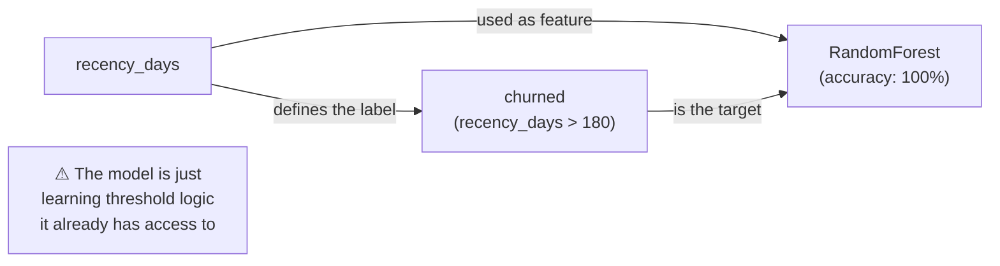
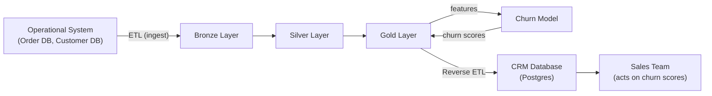

# Chapter 7: The ML Pipeline - RFM, Churn, and Reverse ETL

*← [Back to Index](./index.md)*

---

## 7.1 Why ML and Not Just Dashboards?

A dashboard shows you what happened. A model tells you what's likely to happen next.

Dashboards satisfy requirement 1 (historical analytics) from Chapter 1. They show
revenue trends, top products, monthly active customers. These are *backward-looking*.

The churn model satisfies requirement 3 (feedback loop): it takes the historical
patterns in the Gold layer, predicts which customers are about to stop buying,
and writes that prediction *back* into the CRM where the sales team can act on it.

Adding this closes the data engineering loop: data flows from operations → lakehouse
→ ML → back to operations. Data that stays in a lakehouse and never reaches the
people who can act on it is data that produces no business value. Reverse ETL is
the mechanism that closes this loop.

---

## 7.2 RFM - Why It's the Industry Standard, and Why It Has Limits

**RFM** stands for Recency, Frequency, Monetary. It's the industry-standard feature
set for retail churn prediction because it captures three independent dimensions
of customer behaviour with simple, interpretable metrics:

| Feature | What it measures | Intuition |
|---|---|---|
| **Recency** | Days since last purchase | A customer who bought last week is less likely to churn than one who bought last year |
| **Frequency** | Number of distinct invoices | A customer who orders repeatedly is more loyal than one who ordered once |
| **Monetary** | Total spend | High-value customers often have more brand loyalty |

These three numbers summarise a customer's entire purchase history in a form the
model can immediately use. No complex feature engineering, no NLP, no image data.

**The limits of RFM** are real and worth knowing:

- **No seasonality awareness**: RFM doesn't know that December buyers often don't
  return in January. A customer who last bought in December and hasn't returned in
  30 days isn't churning - they're seasonal. RFM would flag them as at-risk.

- **No product diversity**: A customer who buys the same product repeatedly is
  more vulnerable to a single product change than one who buys across categories.
  RFM sees frequency but not breadth.

- **Cold start problem**: New customers (joined in the last 30 days) have very low
  frequency and their recency looks fine. RFM models systematically underestimate
  churn risk for new customers who have a poor first experience.

- **B2B outlier contamination**: One B2B customer placing a £50,000 bulk order
  skews the `monetary` distribution heavily. Without outlier handling, the model
  treats this as evidence that the customer is loyal (high monetary), when actually
  it's a one-time wholesale purchase.

> [!TIP]
> **Interview Answer**: RFM is industry standard because it's interpretable,
> computable from any transaction history, and captures the three independent
> signals that matter for churn: recency (how recently), frequency (how often),
> monetary (how much). Its limits are no seasonality awareness, no product diversity
> signal, cold start for new customers, and sensitivity to B2B outliers in a
> consumer dataset.

---

## 7.3 The Data Leakage Bug - The Most Important Engineering Story

This deserves its own section because it's the clearest example of a subtle but
catastrophic modelling mistake, and the fix demonstrates correct temporal reasoning.

### The Original (Leaking) Implementation

The first version of the churn model defined the label like this:

```python
# WRONG - data leakage
df = df.withColumn(
    "churned",
    when(col("recency_days") > 180, 1).otherwise(0)
)
```

Here, `recency_days` is computed as "days since this customer's last purchase (relative
to the dataset's maximum date)." Then `churned = 1 if recency_days > 180`.

The model's features are `[recency_days, frequency, monetary]`.
The model's label is `1 if recency_days > 180`.

The `recency_days` feature is **algebraically determined by the label**. If you
know `recency_days`, you know `churned` exactly. The model didn't learn anything
about customer behaviour - it learned that `feature[0] > 180 → label = 1`. Accuracy
was 100%. The model was useless.



### The Temporal Split Fix

The correct approach introduces a **time cutoff** that separates features from labels:

```
|←──── feature window (180 days) ────→|←── label window (90 days) ──→|
dataset_start                       cutoff_date                    max_date

  df_before → compute RFM features (up to cutoff_date)
  df_after  → did the customer purchase again? (the churn label)
```

From [`scripts/train_churn_model.py`](../scripts/train_churn_model.py#L38-L66):

```python
# Temporal split parameters
OBSERVATION_WINDOW_DAYS = 180  # Feature window: 180 days before cutoff
CHURN_WINDOW_DAYS = 90         # Label window: 90 days after cutoff

max_date = df_filtered.agg(max("invoice_date")).collect()[0][0]
cutoff_date = max_date - timedelta(days=OBSERVATION_WINDOW_DAYS)

# Features: computed from data BEFORE the cutoff
df_before = df_filtered.filter(col("invoice_date") < lit(cutoff_date))
rfm = df_before.groupBy("customer_id").agg(
    datediff(lit(cutoff_date), max("invoice_date")).alias("recency_days"),
    # ↑ recency relative to cutoff_date - NOT to max_date
    countDistinct("invoice_id").alias("frequency"),
    sum("revenue").alias("monetary")
)

# Label: did they purchase AFTER the cutoff?
df_after = df_filtered.filter(
    (col("invoice_date") > lit(cutoff_date)) &
    (col("invoice_date") <= lit(cutoff_date + timedelta(days=CHURN_WINDOW_DAYS)))
)

returned_customers = df_after.select("customer_id").distinct() \
    .withColumn("returned", lit(1))

# Left join: customers NOT in returned_customers are churned
rfm = rfm.join(returned_customers, on="customer_id", how="left")
rfm = rfm.withColumn(
    "churned",
    when(col("returned").isNull(), 1).otherwise(0)
).drop("returned")
```

The two operations - feature computation and label assignment - use completely
independent data windows. `recency_days` is now computed relative to `cutoff_date`,
not `max_date`. A customer with `recency_days = 50` (bought 50 days before cutoff)
might or might not have churned (no purchase in the 90-day window after cutoff).
The model has to learn the relationship; it can't just apply a threshold.

| | Leaking Model | Temporal Split Model |
|---|---|---|
| Accuracy | 100% | 77% |
| What it learned | `feature[0] > 180 → label` | Genuine patterns in purchase behaviour |
| Business value | Zero | Real predictive signal |
| recency_days importance | 84.9% | 40.7% |

The 100% accuracy is worthless. The 77% is genuine.

> [!TIP]
> **Interview Answer**: Data leakage is when information that wouldn't be available
> at prediction time is used during training. In the original model, the churn label
> was derived directly from `recency_days` - a training feature. The model learned
> a simple threshold rule, not customer behaviour. The fix is a temporal split:
> features are computed from data before a cutoff date; the label is determined by
> what happened after. These are independent, so there's no leakage.

---

## 7.4 Model Results - Why 77% Is the Right Answer

After the temporal split fix, the model produces:

```
              precision    recall  f1-score   support

           0       0.65      0.64      0.65       328   ← retained customers
           1       0.83      0.83      0.83       681   ← churned customers

    accuracy                           0.77      1009
   macro avg       0.74      0.74      0.74      1009
weighted avg       0.77      0.77      0.77      1009
```

Feature importances:
- `monetary`: 43.2% - total spend is the strongest signal
- `recency_days`: 40.7% - days since last purchase
- `frequency`: 16.1% - distinct invoice count

**Why 77% is the honest success metric:**

The class 0 (retained) F1 of 0.65 is the honest weakness. The model is better
at flagging churners than confirming loyalists. This makes intuitive sense:

A customer who spent £2,000 and bought last month is clearly loyal - the model
handles these easily. But a customer who spent £500 and last bought 5 months ago?
They might return next week, or they might have moved on permanently. The model
correctly expresses uncertainty here (65% F1 on the retained class - not great).

With only 3 RFM features, the model can't distinguish between "bought seasonally
6 months ago and will return at Christmas" vs. "genuinely churned." More features
(purchase category diversity, return rate, seasonal flags) would improve this class.

### The Precision-Recall Tradeoff for Churn

In the context of churn prediction:
- **False Negative** = we predicted "retained" but the customer churned. Cost: we
  lost a customer we could have saved with a retention campaign.
- **False Positive** = we predicted "churned" but the customer was going to return
  anyway. Cost: we sent them a £5 discount voucher they didn't need.

The asymmetry is clear: missing a churner costs you a customer relationship.
Falsely alarming a loyalist costs you £5 and a mildly annoying email.

For churn models, **recall matters more than precision**. You'd rather catch 90%
of churners and accept a 30% false positive rate than catch 60% of churners with
a 5% false positive rate. In business terms: it's better to over-alert than to
miss actual churners.

Practically, this means you'd lower the decision threshold (from 0.5 to 0.3,
say) to increase recall at the cost of precision.

> [!TIP]
> **Interview Answer**: `class_weight="balanced"` tells the Random Forest to
> weight minority class samples more heavily during training. Our dataset has 67%
> churners and 33% retained - without balancing, the model would optimise for
> the majority class. Balanced weights penalise misclassifying the minority class
> (retained customers) more, improving F1 on that class. The `balanced` parameter
> sets each class's weight to `total_samples / (n_classes * class_count)`.

---

## 7.5 The Model Training Code - Key Decisions

```python
# train_churn_model.py (lines 76-88)
X_train, X_test, y_train, y_test = train_test_split(
    X, y,
    test_size=0.2,
    random_state=42,
    stratify=y      # Ensures both splits have the same 67/33 churn ratio
)

model = RandomForestClassifier(
    n_estimators=100,
    random_state=42,
    class_weight="balanced"
)
model.fit(X_train, y_train)
```

**Why `stratify=y`?** Without it, the random 80/20 split might put 90% of retained
customers in the test set and only 10% in training (by chance). `stratify=y`
preserves the class ratio in both splits - the test set is a representative sample.

**Why `random_state=42`?** Reproducibility. Setting a random seed means the same
split and the same model every time. Someone else running the same code on the same
data gets identical results - essential for debugging and for the model being
deterministic in production.

**Why 100 trees?** Diminishing returns: 100 trees gives most of the benefit of
a larger ensemble (500, 1000 trees) for a fraction of the training time. With 5,042
customers and 3 features, 100 trees is more than sufficient.

**Model serialization**:
```python
model_path = os.path.join(os.path.dirname(__file__), "model.pkl")
with open(model_path, "wb") as f:
    pickle.dump(model, f)
```

`pickle` is the standard Python serialization format. The risks:
- **Security**: `pickle.load()` executes arbitrary code in the pickle stream.
  Never load pickled models from untrusted sources.
- **Versioning**: a model pickled with scikit-learn 1.3 may not load correctly
  in scikit-learn 1.5 if the internal class structure changed.
- **Production**: for production, `joblib.dump()` is preferred (more efficient
  for NumPy arrays), or model registries (MLflow, Weights & Biases) that handle
  versioning and environment tracking.

**Training-Serving Skew** is the risk that the preprocessing applied to training
data is not *exactly* replicated at serving time. In our model, the only
preprocessing is feature selection (selecting 3 columns). But if we had applied
StandardScaler or OneHotEncoder during training, we'd need to serialize those
transformers too - not just the model. The correct approach:

```python
from sklearn.pipeline import Pipeline
pipeline = Pipeline([
    ('scaler', StandardScaler()),
    ('model', RandomForestClassifier(...))
])
pipeline.fit(X_train, y_train)

# Serialize the ENTIRE pipeline, not just the model
joblib.dump(pipeline, 'pipeline.pkl')
```

The pipeline ensures the same scaling is applied to new data at inference time.

---

## 7.6 Reverse ETL - Closing the Loop

**ETL** (Extract, Transform, Load) moves data *from* operational systems *into*
analytical ones. **Reverse ETL** is the opposite: it takes analytical results
(churn scores from the Gold layer) and pushes them *back into* operational systems
(the CRM Postgres database) where humans can act on them.



Without Reverse ETL, the churn scores live in the Gold layer. Only data engineers
and analysts with Superset access can see them. The CRM team can't act on them -
they use Postgres, not a lakehouse. Reverse ETL bridges this gap.

### Idempotency in Reverse ETL

The Reverse ETL script must be idempotent. If it runs twice (e.g., due to an
Airflow retry), the CRM should show the same state, not duplicated scores.

The correct approach: **UPSERT** (INSERT or UPDATE based on primary key):

```python
# For each customer with a churn score:
# - If they already have a row in churn_scores: UPDATE the score
# - If not: INSERT a new row
cursor.execute("""
    INSERT INTO churn_scores (customer_id, churn_probability, scored_at)
    VALUES (%s, %s, %s)
    ON CONFLICT (customer_id) DO UPDATE
    SET churn_probability = EXCLUDED.churn_probability,
        scored_at = EXCLUDED.scored_at
""", (customer_id, score, datetime.now()))
```

This `ON CONFLICT DO UPDATE` (Postgres UPSERT) ensures: run it once → insert.
Run it again → update with the same value. The result is the same either way.

### Full Load vs. Incremental Load

| | Full Load | Incremental Load |
|---|---|---|
| What it does | Re-scores ALL customers every run | Only scores customers whose purchase data changed |
| When to use | Small customer base, model is cheap | Large customer base, scoring is expensive |
| Risk | Slower, uses more compute | Need to track which records changed (CDC) |
| What we use | Full load (5,042 customers, negligible compute) | - |

### Race Conditions - Batch and Streaming Both Updating CRM

A risk: the batch churn score job (running nightly) and a real-time scoring job
(running per-request) both try to update the same customer's row in CRM Postgres
simultaneously.

With Postgres, this is handled by row-level locking. The `ON CONFLICT DO UPDATE`
statement takes a row lock - two concurrent writes to the same `customer_id` will
serialize (one waits for the other). No data corruption, but potential latency
spikes if many concurrent writers hit the same customer.

For our batch-only setup, there's no concurrent writer - the batch job is the only
thing writing to `churn_scores`. This simplifies things considerably.

### Should You Delete Records That No Longer Exist in the Lakehouse?

If a customer record is deleted from the Lakehouse (e.g., GDPR right to erasure),
should their churn score row in the CRM also be deleted?

**Yes** - for two reasons:
1. **Data consistency**: the CRM shouldn't show scores for customers who don't
   exist in your data model
2. **GDPR compliance**: if you've deleted the customer from the Lakehouse due to
   a deletion request, any derived data (including churn scores) should also be
   deleted from operational systems

The Reverse ETL script should implement a "soft delete" or a "delete where not in
new snapshot" pattern:

```python
# Get current customer IDs from Gold
current_ids = set(gold_df["customer_id"].tolist())

# Delete CRM rows for customers no longer in Gold
cursor.execute(
    "DELETE FROM churn_scores WHERE customer_id NOT IN %s",
    (tuple(current_ids),)
)
```

---

## 7.7 FastAPI - Why Not Just Run in Airflow?

The churn model could be invoked directly from an Airflow task: score all customers
at midnight, write to CRM. But the business might also want **on-demand scoring**:
"given this specific customer ID right now, what's their churn probability?"

For on-demand scoring, you need a serving layer - a persistent process that can
receive requests and return predictions. That's what FastAPI provides.

```python
# Conceptual FastAPI endpoint
@app.post("/score")
def score_customer(customer_data: CustomerFeatures):
    features = [[customer_data.recency_days,
                 customer_data.frequency,
                 customer_data.monetary]]
    probability = model.predict_proba(features)[0][1]
    return {"churn_probability": probability}
```

The model file (`model.pkl`) is loaded once when FastAPI starts, then reused for
every request. A 2-second inference time for Random Forest on 3 features doesn't
happen - it's microseconds. The 2-second latency scenario would apply to large
neural networks or models doing expensive feature retrieval.

**Why not serve directly from Airflow?** Airflow workers are transient - they
spin up to handle tasks and spin down when idle. There's no persistent HTTP endpoint.
FastAPI is a lightweight ASGI server that runs continuously, dedicated to serving
model predictions.

### API Versioning

If the model is retrained with new features (e.g., adding product category diversity),
the input schema changes. Existing CRM integrations sending `[recency, frequency,
monetary]` would break if the endpoint suddenly expected 4 features.

The solution: API versioning:
- `POST /v1/score` - accepts `[recency, frequency, monetary]` (original model)
- `POST /v2/score` - accepts `[recency, frequency, monetary, category_diversity]`

Both endpoints run in parallel during the migration period. The CRM team migrates
to `/v2` on their own timeline. Once no traffic hits `/v1`, it's deprecated.

> [!TIP]
> **Interview Answer**: Batch scoring (all customers nightly in Airflow) and
> on-demand scoring (per-request in FastAPI) serve different use cases. Batch is
> higher throughput (many customers in one job) but higher latency (results aren't
> available until the next morning). On-demand is lower latency (immediate result)
> but higher infrastructure cost (persistent server, not a batch job). Our pipeline
> uses batch scoring - all customers are scored nightly and results are in the CRM
> by morning.

---

## 7.8 Superset Setup - What Broke

Getting Superset connected to data was the most laborious part of the setup, but
the problems were instructive.

### Problems 1–4: The PyHive Import Chain

Superset supports Hive connections via `PyHive`. The error chain was:

**Problem 2**: pip wasn't installed in the Superset container's virtual environment
(`/app/.venv`). Fix: bootstrap pip with `get-pip.py`.

**Problem 3**: previous pip installations had installed `pyhive` to `~/.local/`
(the user's home directory) instead of `/app/.venv/`. The gunicorn process uses
the venv Python, not the user's home. Fix: install explicitly into the venv:

```bash
docker exec -u root superset bash -c "/app/.venv/bin/python -m pip install pyhive pure-sasl thrift thrift-sasl"
```

**Problems 1 & 4**: SQLAlchemy 1.4.54 expects dialect plugins in `sqlalchemy/dialects/`.
PyHive 0.7.0 changed its registration mechanism and doesn't auto-create this file.
Fix: manually create the dialect registration file:

```bash
docker exec -u root superset bash -c 'cat > /app/.venv/lib/python3.10/site-packages/sqlalchemy/dialects/hive.py << EOF
from pyhive.sqlalchemy_hive import HiveDialect
from sqlalchemy.dialects import registry
registry.register("hive", "pyhive.sqlalchemy_hive", "HiveDialect")
dialect = HiveDialect
EOF'
```

The lesson: when installing Python packages into containerised applications, always
verify *which* Python interpreter and which site-packages directory the application
actually uses. There can be multiple Python environments in one container, and
installing to the wrong one has no visible effect.

### Problem 7: DDL Blocked by Superset Security

When I tried to run `CREATE TABLE` directly in Superset's SQL Lab:

```
This database does not allow for DDL/DML, but the query mutates data.
```

Superset's security model blocks DDL (CREATE, DROP, ALTER) and DML (INSERT, UPDATE,
DELETE) in SQL Lab by default. The setting can be enabled in Database → Advanced →
Security, but it didn't persist after a container restart.

The cleaner solution was to use Superset's **Virtual Dataset** feature: define
a dataset using raw SQL (read-only SELECT), without needing DDL at all:

```sql
SELECT * FROM delta.`s3a://lakehouse/gold/live_order_metrics`
```

This SQL is stored in Superset's own database. Superset executes it against the
Hive/Spark endpoint when a chart requests data. No table registration required.

> [!NOTE]
> **📸 TODO Screenshot**: Capture the Superset SQL Lab (http://localhost:8088)
> showing a successful query result from the Delta table path.

> [!NOTE]
> **📸 TODO Screenshot**: Capture the FastAPI Swagger UI (http://localhost:8000/docs)
> if the FastAPI serving layer has been implemented.

---

## Summary: What Chapter 7 Answers

| Question | Short Answer |
|---|---|
| Why RFM? | Industry standard, interpretable, computable from any transaction history |
| RFM limitations? | No seasonality, no category diversity, cold start problem, B2B outlier sensitivity |
| What was the data leakage bug? | Label (churned) derived directly from a feature (recency_days) - model learned a threshold, not behaviour |
| How was it fixed? | Temporal split: features computed before cutoff_date, label determined by purchases after cutoff_date |
| Why 77% is the right answer? | It's a genuine signal on an honest split. 100% was mathematical tautology with leakage. |
| Precision vs. Recall for churn? | Recall matters more - missing a churner (FN) costs a customer; false alarm (FP) costs a £5 voucher |
| `class_weight="balanced"`? | Upweights minority class during training to prevent majority-class bias |
| What is Reverse ETL? | Moving analytical results back into operational systems for business action |
| Why idempotency in Reverse ETL? | Retries should produce the same CRM state, not duplicate rows. Use UPSERT. |
| Training-Serving Skew? | Preprocessing at training time must be exactly replicated at serving time. Use sklearn Pipelines. |

---

*Next: [Chapter 8 - Governance, Lineage & System Design](./ch8_governance_system_design.md)*
