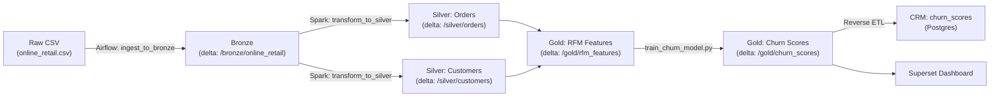
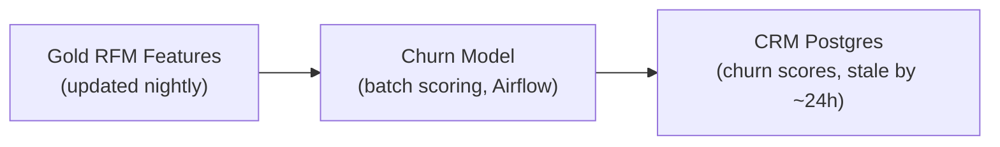
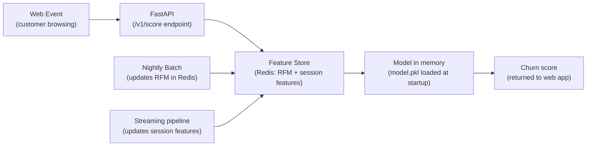
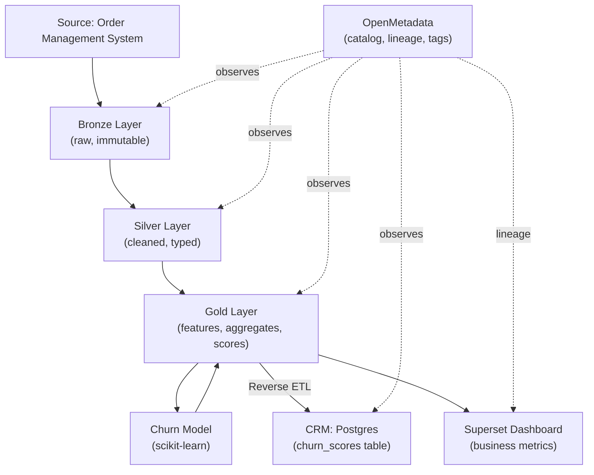

# Chapter 8: Governance, Lineage & System Design

*← [Back to Index](./index.md)*

---

## 8.1 Why Governance Is Not an Afterthought

Seven chapters built the pipes. This chapter asks: *can you defend the system you built?*

Governance is the set of policies, tools, and practices that answer the questions a
senior engineer or engineering manager will ask:
- Who owns this data?
- How do I know what this table contains?
- If a dashboard shows the wrong number, how do I trace it to the broken step?
- Which tables contain PII?
- If I change this dbt model, what downstream tables break?

Without governance, the answer to all of these is "grep around and hope." With
it, the answers are in a catalog, a lineage graph, and a defined data contract.

The governance layer in this project: **OpenMetadata** - an open-source metadata
platform that provides data discovery, lineage, PII tagging, quality metrics,
and a business glossary. It doesn't process data. It observes the data *about*
the data.

---

## 8.2 OpenMetadata - What It Is and What It Actually Does

OpenMetadata is a **metadata platform**, not a processing engine. It sits beside
the pipeline, not inside it. It connects to sources (MinIO, Postgres, Airflow, dbt)
via **connectors** and pulls metadata on a schedule.

What it collects:

| Metadata Type | Examples | Source |
|---|---|---|
| **Technical metadata** | Table schemas, column types, partition keys, row counts | Spark/Hive, Delta log |
| **Operational metadata** | DAG run history, task success/failure, last updated at | Airflow connector |
| **Lineage** | "This Gold table was produced by this dbt model from this Silver table" | dbt manifest, Spark lineage |
| **Business metadata** | "This column means…", column descriptions, dataset owners | Manual annotation |
| **Quality metrics** | Null rates, distinct counts, completeness | Great Expectations integration |
| **Governance tags** | PII, Sensitive, GDPR-scoped | Manual or automated tag propagation |

The value of a metadata platform is **searchability and lineage**. Without it:
- A new analyst asks "what is `monetary` in the churn features table?" and
  has to read the dbt model SQL to figure it out.
- A broken dashboard causes a 2-hour investigation across four different repositories.

With OpenMetadata:
- Column descriptions are in the catalog. Search "monetary" → result: "Total spend
  in GBP by this customer over the feature window."
- A broken dashboard → look at lineage → find the upstream dbt model that failed
  yesterday → look at the dbt run log → find the root cause in 10 minutes.

> [!TIP]
> **Interview Answer**: OpenMetadata is a metadata platform - it collects *data about
> data* from your pipeline components (Airflow, dbt, Spark, Postgres) and presents
> it in a unified catalog with lineage, search, and tagging. It doesn't transform data.
> Its primary value is: (1) lineage for root-cause debugging, (2) discovery for new
> team members, (3) governance tagging for PII and GDPR compliance.

---

## 8.3 Lineage - The Most Requested Feature in Data Engineering

**Lineage** is the graph that shows how data flows from source to consumption.



Why lineage is the most requested feature:

**Debugging**: A Superset chart shows `total_revenue = £0` today. Without lineage,
you'd check: the chart SQL? The Gold table? The Silver transform? The Bronze ingest?
Airflow? MinIO? That's six places to look. With lineage, you click the Gold table
in OpenMetadata, see it was last populated by the `silver_to_gold` dbt model, click
that model, see it ran with errors yesterday, click the error log, find a null
join key. The chain took 3 minutes instead of 2 hours.

**Impact analysis**: A source system engineer tells you they're renaming the
`Customer ID` column to `customer_id` (removing the space) in the raw CSV. Without
lineage: manually grep all your Spark scripts to find where `Customer ID` is used.
With lineage: click the Bronze column in OpenMetadata → see all downstream Silver and
Gold tables that reference it → know exactly what breaks before it breaks.

**Auditing**: A GDPR audit asks which tables contain customer-identifiable data.
Lineage lets you trace from the `customer_id` column in Bronze all the way to which
Gold tables and CRM fields it flowed into.

> [!TIP]
> **Interview Answer**: Lineage tracks the full dependency graph from raw source to
> consumption. Its primary use cases are (1) root-cause debugging - follow the broken
> edge upstream, (2) impact analysis - know what downstream assets break before you
> rename a column, (3) GDPR auditing - trace where PII data flows. OpenMetadata
> builds lineage automatically from dbt's `manifest.json` and from Spark's lineage
> hooks (if instrumented).

---

## 8.4 Technical Metadata vs. Business Metadata

| | Technical Metadata | Business Metadata |
|---|---|---|
| **What it is** | Schema, types, partitions, row count, file path | Column descriptions, dataset purpose, ownership, glossary terms |
| **Who cares** | Data engineers, ops | Analysts, business stakeholders |
| **Where it comes from** | Auto-collected by connectors | Manually added (or LLM-assisted) |
| **Example** | `monetary: DOUBLE NOT NULL` | `monetary: Total spend in GBP over the RFM observation window. Outliers capped at 99th percentile.` |

Technical metadata is free - OpenMetadata's connectors extract it automatically.
Business metadata is expensive - it requires a human to write meaningful descriptions.
This is the documentation problem: engineers are reluctant to write descriptions
because they don't see immediate value. The value compounds when:
- A new team member joins and needs 2 days to understand the data model, vs. 2 hours with a catalog
- An audit asks "what does churned mean exactly?"
- Two teams define "active customer" differently (one says "any purchase in 90 days",
  one says "any purchase in 180 days") and their dashboards disagree

The Glossary in OpenMetadata solves the last problem: **one canonical definition**
of business terms that teams link to columns. When everyone links their "churned"
column to the Glossary entry for "Churn", the definition is explicit and shared.

> [!TIP]
> **Interview Answer**: Technical metadata (schema, types, stats) is auto-collected
> by connectors. Business metadata (descriptions, owners, glossary links) requires
> human effort. The value of business metadata compounds over time: it dramatically
> reduces onboarding time for new engineers and resolves the "two teams have different
> definitions of the same metric" problem via a shared glossary.

---

## 8.5 PII - Preventing Customer Data from Leaking into the Gold Layer

**PII (Personally Identifiable Information)** in this dataset:
- `customer_id` - an identifier that can be linked to a real person in the CRM
- `Country` - low risk on its own, but potentially identifying in combination

What we don't have (thank to the Kaggle dataset being already anonymised):
names, email addresses, physical addresses, IP addresses. But `customer_id` is
still PII because it's a foreign key to the CRM where the real identity is held.

### Where PII Should and Shouldn't Appear

| Layer | PII Policy |
|---|---|
| Bronze | Raw data, PII is here as-is. Restricted access - only pipeline service accounts. |
| Silver | `customer_id` is needed for joins. Still PII. Access controlled. |
| Gold (RFM/Churn) | `customer_id` is the primary key for churn scores. Restricted to ML pipeline. |
| Gold (Aggregates) | Revenue by country, order counts - no customer-level PII. Open to analysts. |
| Superset dashboards | Dashboards should expose aggregate Gold tables. No customer-level queries for general users. |
| CRM (Postgres) | Churn scores with `customer_id`. Restricted to CRM team only. |

The risk: an analyst adds a Superset chart that queries `SELECT customer_id, churn_probability FROM gold.churn_scores ORDER BY churn_probability DESC`. This exposes all customers' churn scores sorted by risk. If Superset is accessible to non-CRM analysts, this is a PII leak.

**Prevention mechanism**:
1. **Tag at the source**: In OpenMetadata, tag the `customer_id` column in Bronze
   as `PII.Sensitive`. Tag propagation means downstream tables that derive from this
   column inherit the tag.
2. **Access control**: The `gold/churn_scores` table and the Reverse ETL CRM target
   are only accessible to the ML pipeline service account and CRM service account.
   Analyst Superset accounts have read access only to aggregate Gold tables.
3. **Audit log**: OpenMetadata logs who queries what. A monthly audit of access
   to PII-tagged tables identifies unexpected access patterns.

> [!TIP]
> **Interview Answer**: PII must be tagged at the Bronze layer - in OpenMetadata, tag
> the `customer_id` column as `PII.Sensitive`. Governance platforms support tag
> propagation, so downstream derived columns inherit the tag automatically. Access
> control should gate PII tables to service accounts only - analysts should query
> aggregate Gold tables, not customer-level ones. The Superset dashboard should surface
> business metrics (total revenue by country, churn rate by segment) - not a queryable
> view of individual customer churn scores.

---

## 8.6 Data Contracts - Preventing Schema Drift at the Source

A **data contract** is a formal agreement between a data producer and its downstream
consumers: "This source will produce data in this schema, and if it changes, it will
notify consumers before shipping the change."

Without a contract, the source system can rename `Customer ID` to `customer_id`,
add a new column, or change a type from `STRING` to `INT`, and your Bronze ingestion
job discovers the change at 2am when it fails.

### What a Data Contract Contains

```yaml
# data_contract_online_retail.yaml
source: online_retail_csv
version: 1.2
owner: retail-ops-team
consumers:
  - openlake-bronze-ingest
  
schema:
  - name: Invoice
    type: string
    nullable: false
    description: "Unique invoice identifier. Format: numeric or 'C' prefix for cancellations"
  - name: Customer ID
    type: string
    nullable: true
    description: "Customer identifier. NULL for anonymous/guest orders."
    pii: true
  - name: InvoiceDate
    type: timestamp
    format: "yyyy-MM-dd HH:mm:ss"
    nullable: false

quality_assertions:
  - column: Invoice
    check: not_null
    threshold: 100%
  - column: Quantity
    check: greater_than_zero
    threshold: 95%  # Allow 5% cancellations (negative quantities)
  
change_policy:
  notification_lead_time: 14 days
  breaking_change_policy: major version bump required
```

**Enforcing it**: Great Expectations runs against the Bronze layer after every
ingestion. If the incoming CSV violates the contract (new column, changed type,
null rate spike in `Invoice`), the ingestion fails loudly instead of silently
loading bad data.

**What the dbt `ref()` function has to do with contracts**: dbt's `ref()` replaces
hard-coded table names. When a model says `FROM {{ ref('stg_orders') }}`, dbt
knows the dependency graph. If you rename the staging model, dbt tells you which
downstream models break - it's a lightweight contract enforcement within the
transformation layer.

> [!TIP]
> **Interview Answer**: A data contract is a formal schema agreement between a source
> and its consumers. Without one, schema changes (renamed columns, new nullables,
> type changes) silently break pipelines. Implementation: (1) a YAML schema definition
> checked into source control, (2) Great Expectations tests that enforce the schema
> at ingestion time, (3) a change notification policy requiring producers to announce
> breaking changes 14 days before shipping. dbt's `ref()` function enforces contracts
> within the transformation layer by making cross-model dependencies explicit.

---

## 8.7 Schema Evolution in Delta Tables

What happens to a Delta table when the upstream schema changes? This is the
**schema evolution** problem and Delta Lake handles it explicitly.

**Schema enforcement** (default): Delta rejects writes whose schema doesn't match
the table schema. If a new CSV has an extra column `Discount`, a write attempt will:

```
AnalysisException: A schema mismatch detected when writing to the Delta table
```

The table is protected. But the pipeline fails until someone manually handles
the new column.

**Schema evolution** (opt-in): If you add `.option("mergeSchema", "true")` to the
write:
```python
df.write.format("delta").mode("append").option("mergeSchema", "true").save(path)
```

Delta will:
- Add the new `Discount` column to the table schema
- Backfill `null` for all existing rows that predate the new column
- Continue writing normally

This is powerful but dangerous - a typo in a column name (`Dicount` instead of
`Discount`) would silently add a bad column rather than failing loudly.

**Tracking schema changes**: Delta's `DESCRIBE HISTORY table` shows every schema
change as a transaction in the log:

```sql
DESCRIBE HISTORY delta.`s3a://lakehouse/silver/orders`
-- Shows: version 0 (CREATE), version 14 (schema change: added Discount column)
```

OpenMetadata's Delta Lake connector picks up schema changes and records them in
the catalog as a timeline of schema versions - you can see what the table looked
like at any point in history.

---

## 8.8 System Design: Real-Time Churn Scoring

**The CEO scenario**: *"The churn model is successful. Now we want real-time churn
scores for every customer as they browse the website."*

Does the current architecture support this? **No.** Here's why, and what you'd
change:

### Current Architecture (Batch)



The batch model scores all customers nightly. A customer who starts showing churn
signals at 2pm won't be flagged until 6am the next morning - 16 hours later.

For a "customer browsing the website" use case, you need a churn score **within
the web request lifecycle** - typically under 200ms.

### The Real-Time Architecture

The problem decomposes into two sub-problems:
1. **Feature freshness**: RFM features are computed nightly. For real-time, you need
   features that reflect the customer's current session behaviour.
2. **Serving latency**: the model inference must return a result in <200ms.



**What changes**:
- **Feature Store (Redis)**: Instead of reading RFM from a Delta table (disk I/O),
  features are pre-materialized into Redis (in-memory, <1ms lookup). The nightly
  batch job updates the RFM features in Redis. A streaming job updates session-level
  features (pages viewed, cart additions) in near-real-time.
- **FastAPI** is already there. The `/v1/score` endpoint reads features from Redis
  and calls `model.predict_proba()` - Random Forest on 3 features takes microseconds.
- **Model inference** doesn't change - Random Forest on 3 features is already fast
  enough.

**What this doesn't solve**: the RFM features are still nightly batch. A customer
who made 5 purchases today (highly loyal signal) won't reflect that in their
`frequency` feature until tomorrow. For a real real-time system, you'd need
a streaming feature pipeline (Spark Structured Streaming → Redis) that updates
RFM features continuously. This is the full **streaming feature engineering** problem
and it's genuinely complex: incremental aggregations, late event handling, and
feature consistency across concurrent updates.

> [!TIP]
> **Interview Answer**: The current batch architecture cannot serve real-time churn
> scores because: (1) features are computed nightly - they don't reflect today's
> behaviour, (2) reading from Delta tables introduces seconds of I/O latency, (3)
> there's no persistent HTTP endpoint in the batch path. The real-time solution
> requires a feature store (Redis) with features materialised by both a nightly batch
> job and a streaming pipeline, plus the existing FastAPI serving layer reading from
> Redis. Model inference itself is already fast enough - the bottleneck is feature
> freshness and feature lookup latency.

---

## 8.9 System Design: SPOF Analysis

**SPOF = Single Point of Failure**: a component whose failure brings down the entire system.

In the current architecture (single Docker host, single-node everything):

| Component | SPOF? | What fails if it dies? |
|---|---|---|
| Docker host (the laptop) | ✅ **Critical SPOF** | Everything - all services are on one machine |
| MinIO | ✅ SPOF | All data is inaccessible. Spark can't read or write. |
| Airflow Scheduler | ✅ SPOF | No DAGs run. Pipelines stop silently. |
| Spark Master | ✅ SPOF | No Spark jobs. Bronze→Silver→Gold pipeline stops. |
| Redpanda | ✅ SPOF | Streaming pipeline stops. No live orders ingested. |
| Postgres (CRM) | ✅ SPOF | Churn scores can't be written. Reverse ETL fails. |
| OpenMetadata | ❌ Not a SPOF | The pipeline still runs. Only governance is unavailable. |

This is a development architecture. It is designed to be cheap and understandable,
not resilient. In production:

**What you'd change for the MinIO SPOF**:
Use ADLS Gen2 (Azure) or S3 (AWS). These are managed, geo-redundant object stores
with 11 nines of durability. A single MinIO container has no replication - one
disk failure loses all data.

**What you'd change for the Airflow SPOF**:
Run Airflow in **CeleryExecutor** mode with multiple workers, or use a managed
Airflow (Cloud Composer, MWAA). The scheduler and workers are decoupled - one
worker dying doesn't stop all DAGs.

**What you'd change for the Spark SPOF**:
Use Databricks, Azure Synapse Spark Pools, or EMR - managed Spark where the master
node is managed by the cloud provider and automatically replaced on failure.

**What you'd change for the host SPOF**:
Move everything to a cloud provider. The entire `docker-compose.yml` stack maps
roughly to managed services that handle host-level failures automatically.

> [!TIP]
> **Interview Answer**: In the current architecture, every component is a SPOF because
> everything runs on one Docker host. The most critical are MinIO (all data stored
> there) and the Airflow Scheduler (pipeline orchestration). In production, you'd
> eliminate SPOFs by: (1) replacing MinIO with geo-redundant cloud storage (ADLS/S3),
> (2) using managed Spark with auto-replaced nodes, (3) running Airflow with multiple
> CeleryExecutor workers, (4) distributing across availability zones. The OpenMetadata
> service is the only non-SPOF - pipelines run without it.

---

## 8.10 System Design: Scaling to Petabytes

**The question**: If the Gold layer grows to petabytes, does the current workflow
scale?

Let's look at what doesn't scale:

### dbt at Petabyte Scale

dbt runs SQL transformations. With PySpark (our current stack), dbt-spark compiles
SQL to run on Spark - which does scale horizontally. But there are constraints:

**`dbt run` is sequential by default** - models in the DAG run one after another.
At petabyte scale, one transformation can take hours. The fix: `dbt run --threads 8`
runs up to 8 models in parallel (those with no dependency on each other).

**Full refresh is catastrophic**: `dbt run --full-refresh` on a petabyte table
would re-read and re-write all data. Solution: incremental materializations only
at scale.

```sql
-- dbt incremental model
{{ config(materialized='incremental', unique_key='invoice_id') }}

SELECT ...
FROM {{ ref('stg_orders') }}

  WHERE invoice_date > (SELECT MAX(invoice_date) FROM {{ this }})

```

At petabyte scale, only today's new records are processed - not the entire history.

**Delta Lake's OPTIMIZE at scale**: The small file problem gets worse at scale.
OPTIMIZE + ZORDER becomes a multi-hour job if run on entire tables. Solution:
partition-level OPTIMIZE on only the partitions modified in the last run.

**The partition strategy matters**: `orders` partitioned by `year/month/day` means
a daily transformation only reads one partition. Without partitioning, Spark scans
the entire table to find today's records.

> [!TIP]
> **Interview Answer**: The current architecture *can* scale to petabytes because it
> uses Spark (horizontal compute) and Delta Lake (columnar, partitioned storage). What
> needs to change: (1) all dbt models must be incremental - no full refreshes, (2)
> partition tables by date so Spark reads only relevant partitions, (3) run OPTIMIZE
> on modified partitions only, not entire tables, (4) increase Spark cluster size
> (more executors, more RAM). dbt itself scales because it compiles to Spark SQL -
> the scaling happens in Spark, not in dbt.

---

## 8.11 System Design: Adding a Second Retail Store

**Scenario**: The business acquires a second retail store with its own order system
and CSV format. How does the architecture accommodate it?

### The Multi-Tenancy Problem

Option A: **Separate namespaces in the same lakehouse**

```
s3a://lakehouse/
  bronze/
    store_a/online_retail/
    store_b/retail_v2/
  silver/
    store_a/orders/
    store_b/orders/
  gold/
    combined/rfm_features/    ← merged view across both stores
    store_a/rfm_features/     ← store-specific analysis
```

Option B: **Separate lakehouses**

```
s3a://lakehouse-store-a/
s3a://lakehouse-store-b/
```

Option A is almost always better. Separate lakehouses mean separate Airflow
instances, separate Spark clusters, separate Superset instances - linear cost growth.
A shared lakehouse with namespace separation keeps one control plane while isolating
data by prefix.

**The ingestion layer**: Two Airflow DAGs, one per store. The Silver and Gold
transformations are the same code - parameterised by `store_id`.

```python
# Parameterised Airflow DAG
dag = DAG(dag_id=f"etl_{store_id}", ...)
```

**The Gold layer**: Two options:
1. Separate Gold tables per store (for store-specific reporting)
2. A combined Gold table with a `store_id` column (for cross-store analysis)

Both are needed. The churn model can be trained on combined data (more training
examples) or store-specific (if stores have very different customer behaviour).

**The schema problem**: Store B uses a different CSV format (`OrderID` instead of
`Invoice`, `ClientNum` instead of `Customer ID`). The Silver transformation must
normalise both to the canonical Silver schema. This is exactly the purpose of the
Silver layer - heterogeneous sources, homogeneous output.

---

## 8.12 System Design: Cost Monitoring and Infrastructure

**Terraform** (Track B - Azure) manages infrastructure as code. The cost question
has two parts: how do you *see* costs, and how do you *control* them?

**Seeing costs**: Azure Cost Management (or AWS Cost Explorer) provides cost
breakdowns by resource tag. The Terraform config should tag every resource:

```hcl
resource "azurerm_storage_account" "lakehouse" {
  tags = {
    project     = "openlake"
    environment = "production"
    owner       = "data-engineering"
    chapter     = "infrastructure"
  }
}
```

With tags, Cost Management shows you: "Last month, the Synapse Spark Pool cost
£340, ADLS Gen2 cost £18, and the VM running Airflow cost £22."

**Controlling costs**:
- **Synapse Spark Pools**: shut down when idle (auto-pause after 15 minutes of
  inactivity). Don't leave Spark clusters running 24/7.
- **Data lifecycle policies**: Bronze data older than 1 year moves to cold tier
  (cheaper storage, slower access). Gold data stays in hot tier (frequently queried).
- **Right-sizing**: a 4-core Spark pool for a 5,000-row CSV is wasteful. Start small;
  scale up when processing time is the bottleneck.

**On a student budget (local setup)**: The local Docker Compose stack costs
approximately £0 in cloud fees. The trade-off is resilience - everything is on
one laptop. The economic argument for cloud: when your time cost of maintaining the
local stack exceeds £20/month, move to cloud.

---

## 8.13 Operational Analytics - The Full Loop

The original requirement from Chapter 1: data should flow from operations →
lakehouse → back to operations. Chapter 7 implemented the Reverse ETL. This chapter
completes the governance picture: *who can see that loop, and how is it audited?*



OpenMetadata doesn't sit in the critical path - it observes. If OpenMetadata goes
down, pipelines keep running. Lineage metadata collection resumes when it comes
back up. This is the right architectural decision: governance tooling should never
be a dependency of data processing.

---

## 8.14 The "Rollback" Question - dbt and Delta Together

**Scenario**: A dbt model deployment produces wrong Gold data. The CEO's dashboard
shows incorrect churn rates. How do you roll back?

**Step 1: Delta Time Travel** - revert the Gold table to before the bad run.

```sql
-- Find the version before the bad dbt run
DESCRIBE HISTORY delta.`s3a://lakehouse/gold/rfm_features`;
-- Output: version 41 was written at 06:15 (before the bad run), version 42 at 06:20

-- Restore to version 41
RESTORE TABLE delta.`s3a://lakehouse/gold/rfm_features` TO VERSION AS OF 41;
```

This is an atomic operation - it creates a new Delta commit (version 43) that
points to version 41's data. Time travel doesn't delete or rewrite files.

**Step 2: dbt rollback** - revert the dbt model to the previous version.

```bash
git revert <bad-commit-hash>
git push
# CI/CD triggers dbt run on the reverted code
```

**Step 3: Re-run Reverse ETL** - the CRM needs updated scores from the restored
Gold table.

```bash
# Trigger the reverse_etl DAG in Airflow
airflow dags trigger reverse_etl_to_crm
```

The combined Delta + dbt rollback capability means you can recover from a bad
transformation in under 30 minutes without touching raw Bronze data.

> [!TIP]
> **Interview Answer**: Rollback works in two steps. First, Delta time travel restores
> the Gold table to its last-known-good version atomically - this creates a new Delta
> commit rather than rewriting files, so it's fast and safe. Second, the dbt model is
> reverted in Git and re-deployed via CI/CD. Finally, the Reverse ETL job re-runs to
> push the corrected scores back to the CRM. The whole rollback takes ~30 minutes and
> doesn't touch Bronze data.

---

## 8.15 Orphaned Data and the Catalog

**Orphaned data** is data that exists in storage but is no longer referenced by
any active pipeline, model, or dashboard. It accumulates silently.

How it happens:
- A Gold table was created for an analysis that is now complete. The analyst moved
  on. The table is still in MinIO, still in the Delta log, using storage.
- A dbt model was deprecated but the `LOCATION` path in MinIO wasn't deleted.
- A Superset dataset was deleted, but the underlying Gold table it queried still exists.

Without a catalog, you'd have to audit MinIO bucket contents and cross-reference
them with Airflow DAGs and dbt manifests manually. OpenMetadata does this
automatically: tables that stop being written to (last modified date stale) and
have no lineage edges (nothing reads from them, nothing writes to them) are flagged
as potentially orphaned.

The clean-up policy:
1. OpenMetadata flags orphaned candidates (tables with no lineage edges, not
   updated in 90+ days)
2. A data engineer reviews the list monthly
3. Archive (move to cold storage) rather than delete immediately - in case someone
   was using it informally
4. Delete after 90-day archive window

This is the same "immutable Bronze, structured lifecycle" principle applied to the
entire lakehouse.

---

## Summary: What Chapter 8 Answers

| Question | Short Answer |
|---|---|
| What is OpenMetadata? | A metadata platform that collects schema, lineage, quality, and governance info - it observes pipelines, doesn't run them |
| Why is lineage the most requested feature? | Enables root-cause debugging (follow the graph upstream), impact analysis (what breaks if I change X), and GDPR auditing |
| Technical vs. business metadata? | Technical = auto-collected (schema, types); business = human-written (descriptions, owners, glossary links) |
| How to prevent PII leaking to Gold? | Tag at Bronze, propagate tags, restrict access at Silver/Gold level, expose only aggregates to analysts |
| What is a data contract? | A formal schema agreement between producer and consumer - schema definition + quality assertions + change notification policy |
| How does Delta handle schema evolution? | Reject by default (schema enforcement); opt-in with `mergeSchema=true` which adds columns and backfills nulls |
| Can you serve real-time churn from the current architecture? | No - features are nightly batch. Real-time needs a feature store (Redis) + streaming feature pipeline + FastAPI |
| What is the single biggest SPOF? | The Docker host - everything runs on one machine. Cloud deployment eliminates host-level SPOFs. |
| How does dbt scale to petabytes? | Incremental materializations only; partition tables by date; run OPTIMIZE on modified partitions. Compute scaling happens in Spark. |
| How do you handle a second store? | Separate namespaces in the same lakehouse; parameterised Airflow DAGs; Silver normalises heterogeneous schemas |
| How do you roll back a bad dbt run? | Delta time travel (RESTORE TO VERSION) + git revert + re-run Reverse ETL |
| What is orphaned data? | Data with no active lineage edges - flagged by catalog, archived then deleted on a defined schedule |

---

*This is the final chapter. [← Back to Index](./index.md)*
